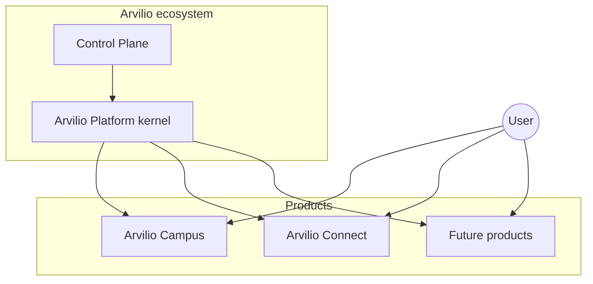
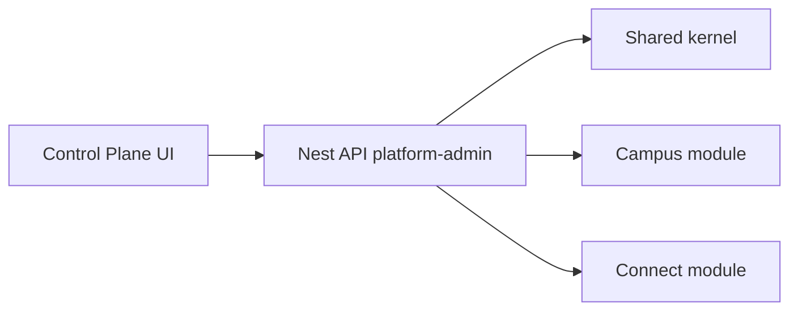

# Arvilio — Ecosystem & Control Plane Plan

> **Audience:** you (solo founder) + future agents.  
> **Companions:** [`business-model.md`](./business-model.md) (money & pillars), [`multi-tenant-execution-plan.md`](./multi-tenant-execution-plan.md) (build phases), ADR-008 / ADR-009 (operators & console).  
> **Status:** strategic plan — 2026-07-10. Not an implementation ticket list.

---

## 1. Ecosystem naming (locked proposal)

Arvilio is an **ecosystem**: one company brand, one shared identity, several products.  
Not “School OS” — that sounded like a tech OS and put “school” in the product name.

### Product names

| Name | Role | Who uses it | When |
|------|------|-------------|------|
| **Arvilio** | Company + ecosystem brand | Everyone (marketing, legal) | Now |
| **Arvilio Platform** | Shared kernel: one `User`, tenants, money A/B/C, Control Plane | Internal + operators | Now |
| **Arvilio Campus** | Product #1 — run courses & teaching businesses (schedule, materials, vocab, chat, bill learners, staff) | Course providers: studios, academies, language schools, solo tutors | **Now (what you built)** |
| **Arvilio Connect** | Product #2 — discovery & matching network | Learners, tutors, campuses | **Later** |
| **…later** | More products on the same Platform | TBD | Future |

**Rejected / do not use:** School OS, Marketplace (as product name), Tutor Recruiting (as separate product name).

### What “Marketplace” was (and why we rename it)

In the old plan, “Marketplace” = students find a tutor/school (finder fee).  
“Tutor Recruiting” = tutors ↔ schools (placement fee).

You described **one** future surface where:

- learners find tutors (and campuses);
- tutors take private learners **and/or** signal “I want to join a campus”;
- campuses (already on Arvilio Campus) hire tutors and receive learners;
- matching works both ways.

That is **one product: Arvilio Connect**, with two money flows inside (finder fee + placement fee) — not two separate brands.

### Shared identity (your “один user скрізь”)

| Concept | Meaning |
|---------|---------|
| One **User** | Same person can use Campus *and* Connect (ADR-006 already: global user + memberships) |
| **Campus tenant** | An organization that runs courses (DB model may still be `School` for a while — internal name ≠ marketing name) |
| Memberships / roles | Same user can be learner in Connect, teacher in a Campus, applicant to another Campus |

Registering once in the ecosystem should not mean “new account per product” — products attach to the same User.

### Why these names

| Name | Why |
|------|-----|
| **Campus** | Premium; fits courses / academies / studios; not the word “school”; still clear it’s where teaching *runs* |
| **Connect** | Matching & network without sounding like a cheap “marketplace” or HR-only “recruiting” |
| **Platform** | The invisible shared layer — not a customer-facing product name on the sidebar |

**Alternatives (if you dislike Campus/Connect later):** Campus → *Studio* / *Academy*; Connect → *Network* / *Match*. Swap only the label; keep the two-product split.



---

## 2. What you actually need (from the business model)

From [`business-model.md`](./business-model.md), the durable needs are:

1. **Operate many schools** (tenants) with isolation — Pillar 1.
2. **Charge schools** for SaaS (Layer B) and later **finder / placement fees** (Layer C / R2–R3).
3. **Let schools charge their own students** (Layer A) with methods you allowlist.
4. **One operator brain** that sees the whole ecosystem — not a half-baked `apps/platform`.
5. **Room to add products** without rewriting auth, billing, or the admin every time.

The current `apps/platform` (ADR-009 MVP) is the right *direction* (separate surface, `PlatformOperator`, audited cross-tenant reads) but too thin for an ecosystem control plane. Treat it as a **seed**, not the final product.

---

## 3. Architecture advice: monolith vs many projects

### Short answer

**Stay on a modular monolith in one monorepo.** Do **not** split into microservices while you are one person.

Your fear (“everything depends on one thing”) is real — but for a solo founder the worse failure mode is **many half-deployed services**, duplicated auth, and weeks lost to glue. Coupling *inside one deployable API* with clear module boundaries is manageable; coupling *across* five repos is not, until you have a team or a hard scale reason.

### What you already have (keep this shape)

| Piece | Role |
|-------|------|
| Monorepo (`apps/*` + `packages/*`) | One git history, shared types, one CI |
| `apps/api` Nest | **One backend process** — modular packages `@be/*` |
| `apps/campus` | Campus UI (tenant product) |
| `apps/platform` | Operator control plane UI (seed) |
| `apps/hub` | Marketing site `arvilio.app` (public; reads CMS) — [`arvilio-marketing-site-payload-plan.md`](./arvilio-marketing-site-payload-plan.md) |
| `apps/cms` | Company Payload CMS (`/cms-admin`, `/payload-api`) |
| Prisma + Postgres | One DB with tenant columns / future product schemas |

This is already a **modular monolith + multiple frontends** — the industry default for early B2B platforms (Basecamp, early Shopify, etc.).

### Recommended evolution (not microservices)

```text
Phase now     →  Modular monolith (one API, many Nest modules, 2–3 Next apps)
Phase later   →  Same monorepo; extract a *worker* or *realtime* process if needed
Phase much later → Split a bounded context only when: separate team, separate SLO,
                   or independent scale (e.g. video egress, marketplace search)
```

| Do | Don’t |
|----|--------|
| New product = new `@be/module-*` + optional `apps/<product>` | New GitHub org / separate DB per idea on day one |
| Shared kernel: auth, tenancy, money layers, audit, feature flags | Copy-paste JWT and Stripe into each service |
| Deploy API as one unit; frontends independently | “Microservice per pillar” before Pillar 2 exists |
| Hard module boundaries + no circular barrels | God `AppModule` that imports everything ad hoc |

**Single point of failure:** mitigate with backups, migrations discipline, uptime monitoring, and *module* isolation — not by inventing a distributed system you cannot operate alone. One well-run Postgres + one API is easier to keep alive than five.

### When to reconsider splitting

Split a context out of the monolith only if **at least two** are true:

- Independent deploy cadence or team ownership
- Different scaling profile (e.g. search/indexing vs transactional API)
- Clear blast-radius need (payments ledger vs chat fan-out)
- You can afford ops (tracing, contracts, dual deploys)

Until then: **monorepo + modular monolith**.

---

## 4. Control Plane — the “one admin for everything”

### Name & job

**Arvilio Control Plane** (evolve today’s `apps/platform`):

- See **fleet** health: schools, MRR, trials, suspensions, storage, incidents
- Configure **platform-global** settings: Layer B billing, payment-method allowlist, integrations defaults, feature flags
- Operate **per product** once they exist: Connect leads & placements
- Never replace **Campus** System/Admin — those stay tenant-scoped inside Campus

### Design principle: products as plugins

Do not hard-code “only Campus” into the nav forever. Structure the console as:

| Area | Examples |
|------|----------|
| **Overview** | Cross-product KPIs, alerts |
| **Tenants / Campuses** | List, detail, suspend, impersonate (exists in seed; DB model may still be `School`) |
| **Billing** | Layer B Stripe config, plans/prices, dunning, promos |
| **Money rails (Layer A policy)** | Allowed learner payment methods (exists) |
| **Products** | Registry of enabled products; each product adds a nav section |
| **Connect** (later) | Leads, placements, finder-fee + placement-fee ledgers |
| **Audit & support** | Platform audit log, impersonation banner |

**Product registry (conceptual):** `{ id, name, status, adminModule }` — adding Connect means registering a product + shipping a module, not forking the console.



### What “flexible” means in practice

1. **Same auth axis** — `PlatformOperator` roles (ADR-008); never reuse campus `ADMIN` for fleet ops.
2. **Same audit path** — every cross-tenant write through `@be/platform-admin` + audit log.
3. **Settings namespaced by product** — `platform.billing.*`, `platform.payments.allowlist`, `connect.*`.
4. **UI sections lazy** — nav entries appear when the product module is enabled / feature-flagged.
5. **Campus stays the deep product UI** — Control Plane links out or impersonates; it does not reimplement lesson calendars.

---

## 5. Phased roadmap

### Phase 0 — Mental model (now)

- Treat the current app as **Arvilio Campus** on **Arvilio Platform** (one User, many future products).
- Keep building in the monorepo; stop thinking “platform app = finished admin”.
- Document money layers A/B/C (business-model + ADR-008).

### Phase 1 — Control Plane v1 (harden the seed)

Goal: operators can run Campus without env archaeology.

- Dashboard that is trustworthy (counts, trials, storage, subscription state)
- Tenants (campuses) list/detail + suspend/activate + audited impersonation
- **Layer A allowlist** (already started) — clear copy
- **Layer B Stripe config in UI** (keys/prices with env fallback) — see prior payment plan
- Promo codes, audit log
- Brand surface as **Arvilio Control Plane** when ready (domain later)

### Phase 2 — Campus multi-tenant maturity

- Payment settings on tenant (`School` model today) — not only `PlatformSettings` singleton
- Entitlements + storage + seats solid for many campuses
- Self-serve signup / trial — PLG engine for Campus
- **Marketing site (`apps/hub`) + company CMS (`apps/cms`)** — public brand on `arvilio.app`; Payload in separate cms app (brand-kit, product registry, **extensible UI locales**); Payload leaves Campus ([plan v2](./arvilio-marketing-site-payload-plan.md))

### Phase 3 — Arvilio Connect (matching network)

- One product surface: learner↔tutor, tutor↔campus, campus receives platform-sourced learners
- Modules + ledgers: finder fee + placement fee (former marketplace + recruiting pillars)
- Optional `apps/connect` (product app) — **not** the marketing site; www only deep-links
- Control Plane section: leads, placements, fee status
- Still **same API process**, new Nest module(s)

### Phase 4 — Extract only if forced

- Workers for heavy jobs, search service, etc. — still prefer monorepo packages first

---

## 6. Concrete “what to do next” (priority order)

1. **Lock names:** Arvilio / Platform / **Campus** / **Connect** (this doc §1).
2. **Harden Control Plane** for Campus ops (billing config + allowlist + real dashboard).
3. **Finish Campus tenancy seams** (tenant-scoped payment config).
4. **Scaffold marketing site** when ready for public brand: `apps/hub` + `apps/cms` (brand-kit + products + locales) ([plan v2](./arvilio-marketing-site-payload-plan.md)) — can run in parallel with (2)–(3); do not block Campus retention.
5. **Do not build Connect UI** until Campus retention is proven with design partners ([business-model §6 Phase A](./business-model.md)).
6. When Connect starts: Nest module(s) + Control Plane nav — same monorepo; reuse the same User.

---

## 7. Decisions locked by this doc

| Question | Decision |
|----------|----------|
| Monolith vs microservices | **Modular monolith in one monorepo**; extract later only with hard reasons |
| One admin for everything? | **Yes — Arvilio Control Plane** (evolve `apps/platform`); Campus System stays tenant-local |
| How to add products? | **Product registry + Nest modules + optional Next apps**; shared kernel for auth/tenancy/money/audit |
| Product names | **Campus** (ops) + **Connect** (matching); not School OS / Marketplace / Recruiting as brands |
| Identity | **One User** across Campus and Connect; tenants = campuses (orgs) |
| When Connect | After Campus is operable for multiple tenants; schema seams early, product UI later |
| Marketing site / Payload | **`apps/hub` + `apps/cms`** for `arvilio.app`; product registry + brand-kit; **extensible UI locales** (v1 ship `uk`/`en`); product data + **learning languages** stay Prisma/API — [plan v2](./arvilio-marketing-site-payload-plan.md) |

---

## 8. Naming status (2026-07-10)

| Item | Status |
|------|--------|
| Ecosystem / company | **Arvilio** |
| Product #1 (ops) | **Arvilio Campus** (UI tag: Campus) |
| Product #2 (matching) | **Arvilio Connect** (future) |
| Monorepo `package.json` name | `arvilio` |
| Auth cookies | `arvilio_at` / `arvilio_rt` |
| Headers / localStorage / zustand | `arvilio` / `x-arvilio-*` |
| Docs / default hostnames | `*.arvilio.app` (DNS still TBD) |
| Local Postgres user/db/volume | **still `soenglish`** (data continuity) |
| Folder `Programming/SoEnglish` → `Arvilio` | Manual — close Cursor, `mv`, reopen |
| GitHub `english_platform` → `arvilio` | Manual — `gh auth login` then `gh repo rename arvilio` |
| Prisma `School` model | Keep for now (internal); user-facing copy → campus / organization |

## 9. Open (validate later, not blockers)

- Exact Control Plane domain (`admin.arvilio.app` vs path).
- Connect as separate Next app vs routes under a product host (not marketing www).
- Prefer **Studio** / **Academy** instead of Campus? Prefer **Network** instead of Connect?
- When to rename local Postgres identity (`soenglish` → `arvilio`) with dump/restore.
- CMS admin: `apps/cms` `/cms-admin` (prod may be `cms.arvilio.app`); hub stays public-only.
- Which UI locales to enable after `uk`/`en` (extend `SUPPORTED_LOCALES` + www `enabledLocales`; not a fixed two-language product).
- Learning-language catalog growth (already multi-code seed) vs marketing copy that still says “English” in places.

---

## Links

- [`business-model.md`](./business-model.md) — pillars R1–R6, pricing  
- [`arvilio-marketing-site-payload-plan.md`](./arvilio-marketing-site-payload-plan.md) — marketing hub v2: brand-kit, product registry, i18n, Payload extraction  
- [`multi-tenant-execution-plan.md`](./multi-tenant-execution-plan.md) — engineering phases  
- [`adr/ADR-008-platform-vs-school-operators-and-billing.md`](./adr/ADR-008-platform-vs-school-operators-and-billing.md)  
- [`adr/ADR-009-platform-admin-console.md`](./adr/ADR-009-platform-admin-console.md)  
- Cursor plan (tactical): Platform payment allowlist + Layer B Stripe UI (implementation follow-up)
