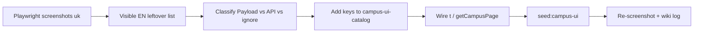

# Campus: scalable locale switcher + page-by-page Payload audit

> **Status:** plan only — 2026-07-12  
> **Audience:** founder + coding agents  
> **Companions:** [`tmp-i18n-leftovers-inventory.md`](./tmp-i18n-leftovers-inventory.md), [`arvilio-marketing-site-payload-plan.md`](./arvilio-marketing-site-payload-plan.md), wiki [[concepts/campus-i18n]], [[concepts/payload-cms]]  
> **Crawl tooling:** `scripts/crawl-campus-i18n.mjs`, `scripts/audit-campus-i18n-leftovers.py`

---

## 0. Why

Today Campus ships **uk + en**. The UI language switcher is a horizontal **EN | UK** toggle (`LocaleSwitcher`) that maps every locale to a button. That breaks as soon as we add `pl`, `de`, `es`, …

Separately, a large share of visible chrome is still hardcoded English (inventory ~605 unique leftovers). We already have Payload collections (`campus-strings` / `campus-pages` / `campus-nav` / `campus-tours`) and a catalog fallback — but coverage is incomplete.

This plan does two things in order:

1. **Design a locale switcher** that scales to a large allowlist without redesigning every screen later.
2. **Page-by-page audit** — each stage is one route: Playwright screenshot(s) under `uk` (and later other locales) → agent analyzes remaining EN chrome → extract only **UI chrome** into Payload (not live product data).

---

## 1. Locked boundaries (do not reopen per page)

| Goes to **Payload** (`apps/cms`) | Stays in **Prisma / Nest** |
|----------------------------------|----------------------------|
| UI chrome strings (`t('…')`) | Users, memberships, roles |
| Page title / subtitle / empty-state chrome | Lessons, balances, chat messages |
| Nav structure + labels | Vocab cards, quiz content, progress |
| Tour step titles/bodies | School branding seller secrets / packages |
| Legal *templates* (markdown + `{{vars}}`) | Transactional / tenant SoT |

Catalog `@pkg/types` `campus-ui-catalog` = **seed + code fallback**, not a second runtime SoT.

**UI locale ≠ learning language.** Switcher changes Campus chrome language (`User.locale`, URL prefix). Subjects taught stay in Prisma `Language`.

**URL rule (Campus):** default `en` unprefixed; other locales `/{code}/…`; `/en/…` redirects to bare path.

---

## 2. Scalable locale switcher (design target)

### 2.1 Problem with current control

```text
[ EN ] [ UK ]     ← one button per locale
```

At 8–20 locales this becomes a chip strip, wraps badly in collapsed sidebar / mobile drawer, and forces hardcoded `locale.enShort` / `locale.ukShort` branches.

### 2.2 Recommended UX (ship in phases)

**Primary pattern — compact trigger + searchable menu**

| Surface | Control |
|---------|---------|
| Expanded sidebar / Profile Account | Button showing **current language native name** (e.g. `English`, `Українська`) + chevron → popover/listbox |
| Collapsed sidebar / auth footer | Same trigger, **short code** (`EN`) or globe icon only |
| Mobile drawer | Full-width row → bottom sheet / full list |

**List behavior (must-have for “many languages”):**

1. Show only **enabled** locales (`site-settings.enabledLocales` ⊆ `SUPPORTED_LOCALES`), not the whole ISO list.
2. **Search** when `enabledLocales.length >= 8` (filter by native name + English name + code).
3. Sort: current locale first, then alphabetical by native name (locale-aware `Intl.Collator`).
4. Optional: “Suggested” group from `Accept-Language` / school default (max 3).
5. Persist: URL + cookie + best-effort `User.locale` (already wired).

**Do not:**

- Put 15+ radio pills in the sidebar.
- Use flags as the only signal (ambiguous, political, a11y-weak) — optional small flag beside text later, never alone.
- Hardcode per-locale label keys like `locale.ukShort` for every new code — drive labels from a **locale metadata table** (see §2.3).

### 2.3 Locale metadata (code)

Extend shared types (not Payload documents per language name):

```ts
// packages/shared/types — conceptual shape
type LocaleMeta = {
  code: Locale;           // 'uk' | 'en' | 'pl' | …
  nativeName: string;     // 'Українська'
  englishName: string;    // 'Ukrainian'
  shortCode: string;      // 'UK' / 'EN' / 'PL' (display)
  dir?: 'ltr' | 'rtl';     // future
};
```

- SoT for **which codes exist:** `SUPPORTED_LOCALES`.
- SoT for **which are live:** CMS `enabledLocales` (Campus already falls back to shipped set if CMS down).
- Labels for the switcher itself stay in code metadata (stable); optional override via `campus-strings` keys `locale.meta.{code}.native` only if editors must rename.

### 2.4 Switcher implementation stages (separate from page audit)

| Stage | Deliverable | Acceptance |
|-------|-------------|------------|
| **S0** | Spec + a11y (listbox, `aria-expanded`, keyboard) | Written in this doc + wiki |
| **S1** | Replace pill strip with trigger + menu for 2 locales | Visual parity; no regression on `/login`, sidebar, mobile | **Done 2026-07-12** |
| **S2** | Locale metadata map; remove `en`/`uk`-only branches in `LocaleSwitcher` | Adding a third code to allowlist + meta does not require JSX changes | **Done 2026-07-12** |
| **S3** | Search when ≥8 enabled; suggested group | Manual QA with fake 10-locale enable list in CMS |
| **S4** | Align Hub + Campus switcher UX (shared component or shared meta) | Same interaction model |

**Agent prompt — switcher S1 (copy-paste):**

```text
Implement Campus LocaleSwitcher redesign (docs/campus-i18n-payload-page-audit-plan.md §2).

Goals:
- Replace EN|UK pill strip with a compact trigger + dropdown/listbox.
- Keep URL locale rules (en unprefixed, /uk/…, cookie, User.locale best-effort).
- Support compact=true (sidebar collapsed / auth) showing shortCode only.
- a11y: role=listbox or menu, aria-expanded, Escape closes, focus trap optional.
- Do NOT add new locales to SUPPORTED_LOCALES yet.
- Match existing Campus design tokens / SCSS modules; no purple AI look.
- Update wiki concepts/campus-i18n when done.
- skip wiki only if I say so.

Files: apps/campus/src/components/i18n/LocaleSwitcher.tsx(+scss), call sites.
Tests: unit for replaceLocaleInPath still used; smoke /login and /uk/login.
```

---

## 3. Page audit methodology (every stage)

Each **page stage** is one route. Do not batch five pages in one agent run unless the user asks.

### 3.1 Pipeline



### 3.2 Artifacts per page

Create under `docs/tmp-i18n-audit/<slug>/` (gitignored or tmp — fine to regenerate):

| File | Contents |
|------|----------|
| `uk-desktop.png` | Full-page or above-fold + scrolled key panels |
| `uk-mobile.png` | Optional 390×844 |
| `en-desktop.png` | Optional baseline |
| `leftovers.md` | Visible EN strings still showing under `uk` |
| `extract.md` | Proposed `campus-strings` / `campus-pages` keys + decisions |

### 3.3 Classification rules (agent must apply)

| Visible text | Action |
|--------------|--------|
| Hardcoded EN chrome (“Daily goals”, “Open calendar”) | → `campus-strings` + `t()` |
| Long legal / static article body | → `campus-pages` richText/markdown |
| User/school content (“Jest Student”, lesson titles, word cards) | **Ignore** (API/seed data) |
| Numbers, dates, currency amounts | Ignore (formatters) |
| Already `t('…')` but missing UK translation | Fix catalog / CMS seed only |
| Nest error toast / GraphQL message | Out of scope unless product decides CMS error map later |

### 3.4 Shared Playwright harness (reuse)

Prefer extending `scripts/crawl-campus-i18n.mjs` rather than one-off scripts:

- Base URL `http://localhost:4200`
- Locale cookie / `/uk` prefix
- Roles: `public` | `student` | `teacher` | `admin` as needed for the page
- Screenshot path + JSON leftovers dump

Dev deps: Campus `:4200`, API `:3000`, ideally CMS `:4410` (fallbacks OK if CMS down).

---

## 4. Master prompt template (paste into each stage)

Replace `{{PATH}}`, `{{ROLES}}`, `{{PRIORITY}}`, `{{NOTES}}`.

```text
You are auditing Campus i18n → Payload for ONE route only.

Route: {{PATH}}
Roles to open: {{ROLES}}
Priority: {{PRIORITY}}
Notes: {{NOTES}}

Follow docs/campus-i18n-payload-page-audit-plan.md §3.

## Step 1 — Screenshots (mandatory first)
1. Ensure Campus is up on :4200 (and API if auth required).
2. Using Playwright (script or agent-browser), open the page under Ukrainian UI (`/uk{{PATH}}` or locale cookie).
3. Save screenshots to docs/tmp-i18n-audit/{{slug}}/ (uk-desktop.png; mobile if layout differs).
4. Do not edit product code before screenshots exist.

## Step 2 — Analyze leftovers
1. List visible English chrome still showing under uk (ignore API/seed data names, amounts, dates).
2. Cross-check docs/tmp-i18n-leftovers-inventory.md for this path.
3. Write docs/tmp-i18n-audit/{{slug}}/leftovers.md and extract.md with:
   - keys to add (area.element.name)
   - campus-pages vs campus-strings
   - strings that must NOT go to Payload

## Step 3 — Implement (only after extract.md)
1. Add EN+UK to packages/shared/types campus-ui-catalog.
2. Wire useCampusT() / getCampusPage as appropriate.
3. npm run seed:campus-ui -w @app/cms if CMS collections need new keys/pages.
4. Re-open /uk{{PATH}}, confirm chrome is Ukrainian; re-screenshot if material.
5. Update docs/llm-wiki/wiki/concepts/campus-i18n.md + wiki/log.md.

Constraints:
- Do not put lessons/users/vocab/billing data into Payload.
- Do not expand scope to other routes.
- Surgical diffs; match existing patterns in lib/cms.
- skip wiki only if I say so.
```

---

## 5. Page stages (order + prompts)

Priority bands match the leftovers inventory. **Complete S1 switcher before or in parallel with P0 pages** — switcher is global chrome and will appear on every screenshot.

`{{slug}}` = path with `/` → `-` (e.g. `/practice/quiz` → `practice-quiz`).

### Wave 0 — Global chrome (do once)

| ID | Scope | Roles |
|----|--------|-------|
| **G0** | Shell: sidebar, header, cookie banner, 404, locale switcher surface | student |

Many of these were partially wired; still re-screenshot after switcher S1.

**Prompt G0:**

```text
{{use master template}}
Route: /dashboard (focus: shell only — sidebar, header, cookie banner, locale control)
Roles: student
Priority: P0-global
Notes: Do not deep-fix dashboard widgets in this stage. After screenshots, only extract shell chrome still EN under /uk. Implement LocaleSwitcher S1 if not done (plan §2).
slug: shell-global
```

---

### Wave P0 — Student daily journey + auth

| ID | Path | Roles | Inventory hint |
|----|------|-------|----------------|
| **P0.1** | `/login` | public | mostly done; verify | **Done 2026-07-12** — `docs/tmp-i18n-audit/login/` |
| **P0.2** | `/forgot-password` | public | | **Done 2026-07-13** — `docs/tmp-i18n-audit/forgot-password/` |
| **P0.3** | `/reset-password` | public | token flow if possible | **Done 2026-07-13** — `docs/tmp-i18n-audit/reset-password/` |
| **P0.4** | `/signup` | public | if still exposed | **Done 2026-07-13** — `docs/tmp-i18n-audit/signup/` |
| **P0.5** | `/onboarding` | student | | **Done 2026-07-13** — `docs/tmp-i18n-audit/onboarding/` |
| **P0.6** | `/dashboard` | student, teacher, admin | largest leftover set | **Done 2026-07-13** — `docs/tmp-i18n-audit/dashboard/` |
| **P0.7** | `/practice` | student | | **Done 2026-07-13** — `docs/tmp-i18n-audit/practice/` |
| **P0.8** | `/practice/vocabulary` | student | | **Done 2026-07-13** — `docs/tmp-i18n-audit/practice-vocabulary/` |
| **P0.9** | `/practice/quiz` | student | | **Done 2026-07-13** — `docs/tmp-i18n-audit/practice-quiz/` |
| **P0.10** | `/practice/speaking` | student | | **Done 2026-07-13** — `docs/tmp-i18n-audit/practice-speaking/` |
| **P0.11** | `/practice/irregular-verbs` | student | | **Done 2026-07-13** — `docs/tmp-i18n-audit/practice-irregular-verbs/` |
| **P0.12** | `/lessons` | student, teacher | | **Done 2026-07-13** — `docs/tmp-i18n-audit/lessons/` |
| **P0.13** | `/lessons/[lessonId]` | student, teacher | use seeded lesson id | **Done 2026-07-13** — `docs/tmp-i18n-audit/lesson-detail/` |
| **P0.14** | `/calendar` | student, teacher | include LessonModal open state as sub-shot | **Done 2026-07-13** — `docs/tmp-i18n-audit/calendar/` |
| **P0.15** | `/chat` | student, teacher | chrome only, not message bodies | **Done 2026-07-13** — `docs/tmp-i18n-audit/chat/` |
| **P0.16** | `/payment` | student | | **Done 2026-07-13** — `docs/tmp-i18n-audit/payment/` |
| **P0.17** | `/profile` | student | all tabs | **Done 2026-07-13** — `docs/tmp-i18n-audit/profile/` |
| **P0.18** | `/vocabulary` | student | legacy alias | **Skipped** — same as P0.8 (re-export) |
| **P0.19** | `/quiz` | student | legacy alias | **Skipped** — same as P0.9 (re-export) |

**Prompt P0.6 example (dashboard):**

```text
You are auditing Campus i18n → Payload for ONE route only.

Route: /dashboard
Roles to open: student, then teacher (separate screenshots)
Priority: P0
Notes: Hero, daily goals, word of day, stat tiles, empty states, quick actions. Ignore live names/counts. Compare to inventory §/dashboard.

Follow docs/campus-i18n-payload-page-audit-plan.md §3 and §4 master template.
slug: dashboard
```

**Prompt P0.17 (profile — multi-tab):**

```text
Route: /profile
Roles: student
Priority: P0
Notes: Screenshot EACH tab (profile, statistics, notifications, connections, appearance, achievements, account). Locale switcher lives on Account — verify new switcher UX. Ignore user PII from seed.
slug: profile
Use master template §4.
```

Copy the master template for every other P0 row; only change Route / Roles / Notes / slug.

---

### Wave P1 — Secondary student / teacher + public legal

| ID | Path | Roles |
|----|------|-------|
| **P1.1** | `/materials` | teacher (+ student if visible) | **Done 2026-07-13** — list + form chrome; `docs/tmp-i18n-audit/materials/` |
| **P1.2** | `/students` | teacher, admin | **Done 2026-07-13** — list + groups; `docs/tmp-i18n-audit/students/` |
| **P1.3** | `/students/[studentId]` | teacher | hero + tabs | **Done 2026-07-16** — `docs/tmp-i18n-audit/student-detail/` |
| **P1.4** | `/students/groups` | teacher | **Skipped** — redirect to `/students?view=groups` (P1.2) |
| **P1.5** | `/privacy` | public | **Done 2026-07-16** — `PrivacyHeading` + CMS body; `LegalFooter`; `docs/tmp-i18n-audit/legal/` |
| **P1.6** | `/offer` | public | **Done 2026-07-16** — chrome via `offer.*`; package label/description from API |
| **P1.7** | `/status` | public | **Done 2026-07-16** — already wired `status.*` |
| **P1.8** | `/legal/terms` | public | **Done 2026-07-16** — CMS markdown body via `LegalDocumentClient`; shell loading `legal.loading` |
| **P1.9** | `/legal/payment-refund` | public | **Done 2026-07-16** — CMS markdown body via `LegalDocumentClient`; shell loading `legal.loading` |
| **P1.10** | `/legal/contacts` | public | **Done 2026-07-16** — chrome via `legal.contacts.*`; seller field values stay API data |

**Prompt P1.5 (privacy — pages collection):**

```text
Route: /privacy
Roles: public
Priority: P1
Notes: Body should already come from getCampusPage('privacy'). Screenshot uk+en. Any remaining EN chrome (heading, footer, updated date label) → campus-strings. Do not move seller Prisma vars into Payload.
slug: privacy
Use master template §4.
```

---

### Wave P2 — Admin / finance / system

| ID | Path | Roles |
|----|------|-------|
| **P2.1** | `/admin` | admin | **Done 2026-07-16** — `admin.*` + `studentImport.*`; `docs/tmp-i18n-audit/admin/` |
| **P2.2** | `/staff` | admin | **Done 2026-07-16** — `staff.*` + shared `stats.range.*`; `docs/tmp-i18n-audit/staff/` |
| **P2.3** | `/finance` | admin | **Done 2026-07-16** — `finance.*` + `staffPayout.*`; `docs/tmp-i18n-audit/finance/` |
| **P2.4** | `/billing` | admin | **Done 2026-07-16** — `billing.*` + reused `entitlements.*`; `docs/tmp-i18n-audit/billing/` |
| **P2.5** | `/system` | super_admin | **Done 2026-07-16** — `system.*` (all tabs); `docs/tmp-i18n-audit/system/` |
| **P2.6** | `/mascot-preview` | any | **Done 2026-07-16** — `mascot.preview.*`; `docs/tmp-i18n-audit/mascot-preview/` |

**Prompt P2.5:**

```text
Route: /system
Roles: super_admin
Priority: P2
Notes: Screenshot each system tab. Extract only chrome labels/descriptions. Provider secrets, connection status values, and school config stay API — never Payload.
slug: system
Use master template §4.
```

---

## 6. Execution cadence

| Cadence | Work |
|---------|------|
| Sprint start | Switcher S1–S2 (Wave 0) |
| Then | One P0 page per agent session (or max 2 tiny auth pages) |
| After each page | `seed:campus-ui`, re-screenshot, wiki log line |
| Weekly | Re-run crawl script; refresh `docs/tmp-i18n-leftovers-inventory.md` |
| Before enabling locale N | Switcher S3 + full P0 smoke in that locale |

**Do not** enable `pl`/`de` in production until Wave P0 chrome is clean for `uk` and catalog has translations for the new locale.

---

## 7. Done criteria

### Switcher

- [ ] Works with ≥10 fake enabled locales without layout break
- [ ] Search appears at ≥8
- [ ] No per-locale JSX branches beyond metadata lookup
- [ ] Keyboard + screen reader usable
- [ ] Compact + expanded + mobile covered

### Payload coverage (Campus)

- [ ] Re-crawl under `/uk` for P0 routes: no **chrome** EN leftovers (seed data excluded)
- [ ] Every new key exists in catalog EN+UK and is seeded to CMS
- [ ] CMS down → UI still shows catalog fallback (never blank)
- [ ] Zero temptation to store lessons/users in Payload

### Process

- [ ] Each completed stage has `docs/tmp-i18n-audit/<slug>/` screenshots + `extract.md`
- [ ] Wiki `concepts/campus-i18n` + `log.md` updated same session

---

## 8. Quick start commands

```bash
# Dev
npm run dev:api      # :3000
npm run dev:campus   # :4200
npm run dev:cms      # :4410 (optional but preferred)

# After string/page changes
npm run seed:campus-ui -w @app/cms

# Existing crawl (extend for screenshots as needed)
node scripts/crawl-campus-i18n.mjs
```

Agent one-liner to start the program:

```text
Read docs/campus-i18n-payload-page-audit-plan.md. First implement switcher S1 (§2), then run page stage P0.1 with the master prompt (§4). Stop after one stage and summarize leftovers extracted.
```

---

## 9. Related code map

| Concern | Path |
|---------|------|
| Switcher (today) | `apps/campus/src/components/i18n/LocaleSwitcher.tsx` |
| Locale helpers | `packages/shared/types/src/lib/locale.ts` |
| String catalog | `packages/shared/types/src/lib/campus-ui-catalog.ts` |
| CMS client | `apps/campus/src/lib/cms/` |
| Proxy URL locale | `apps/campus/src/proxy.ts` |
| Seed | `apps/cms/payload/seed-campus-ui.ts` |
| Prior inventory | `docs/tmp-i18n-leftovers-inventory.md` |
