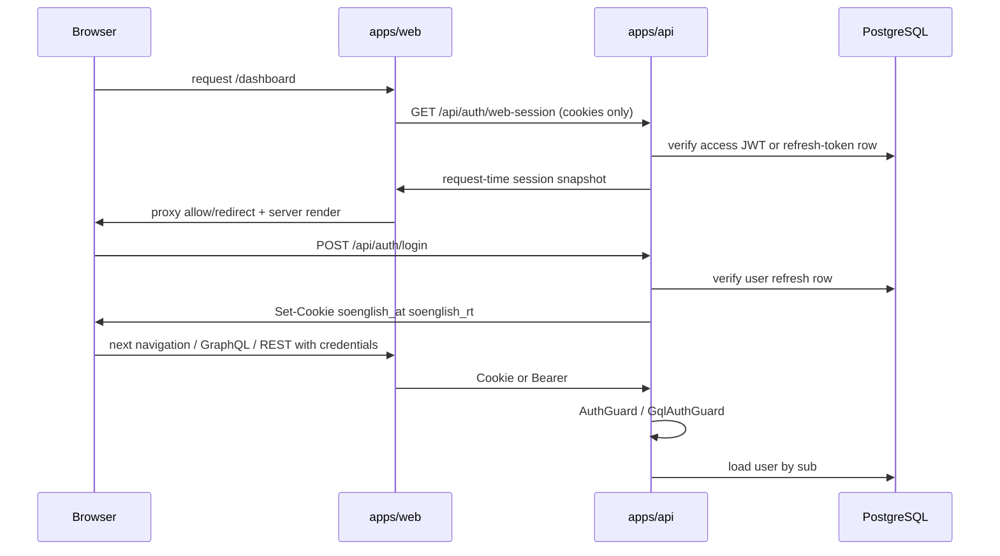

# Auth & RBAC

Authentication and authorization for SoEnglish. Auth is now split into **request-time authentication** (Next proxy + server session handoff) and **backend authorization** (Nest guards + service checks).

## Authentication flow

### Tokens & cookies

| Cookie | Purpose | TTL |
|--------|---------|-----|
| `soenglish_at` | JWT access token (httpOnly) | 30 min |
| `soenglish_rt` | Refresh token (httpOnly) | 30 days |

Implementation: [`module-auth/src/shared/auth-cookies.ts`](../../../../packages/backend/modules/module-auth/src/shared/auth-cookies.ts), [`AuthSessionService`](../../../../packages/backend/modules/module-auth/src/application/auth-session.service.ts).

- Access JWT payload: `{ sub: userId }` — **no role in token**
- Refresh tokens stored as SHA-256 hash in `AuthRefreshToken`
- Password reset links are stored as SHA-256 one-time tokens in `PasswordResetToken`
- Reset tokens live for **60 minutes**; each new forgot-password request deletes older reset tokens for that user before issuing a fresh one

### Account provisioning

Self-registration **within an existing school is disabled** (members are admin-created). But there is **self-serve school creation** (Phase 4.5.1): anyone can create a *new* school and become its first admin.

| Path | Resulting role |
|------|----------------|
| **Self-serve `POST /api/auth/register-school`** (public) | new `School(TRIAL)` + admin `User(ADMIN)` + `SchoolMembership(ADMIN)` + `SchoolSubscription(TRIALING, +7d)`; auto-login. Web `/(auth)/signup`. No card. Code: `SchoolSignupService.registerSchool` |
| Admin `createAdminUser` / `POST /api/admin/users` | STUDENT (ADMIN) or student/teacher/admin (SUPER_ADMIN); optional profile fields; auto-generated password + welcome email. **Creates a `SchoolMembership(role, ACTIVE)` in the current school (ADR-006)** and blocks a new STUDENT past the plan's seat cap (`EntitlementsService.canAddActiveStudent`, 403) |
| Google OAuth | **Existing users only** — links Google to a pre-provisioned email; unknown emails redirect to `/login?error=no_account`, and non-`ACTIVE` accounts redirect with `account_paused` / `account_leaved` / `account_blocked` |
| `npm run super-admin` CLI | **SUPER_ADMIN** only |

Code: `AuthService.createUserAsAdmin`, `AuthService.upsertGoogleUser`, `SchoolSignupService.registerSchool` in [`module-auth/src/application/`](../../../../packages/backend/modules/module-auth/src/application/).

### Session endpoints

- `POST /api/auth/login`, `refresh`, `logout`
- `GET /api/auth/me` — current user DTO; returns `403` with stable `code` for non-`ACTIVE` accounts instead of silently authenticating them
- `GET /api/auth/web-session` — non-mutating request-time session snapshot for Next middleware / server rendering; returns `authenticated`, `authStrategy` (`access` / `refresh` / `anonymous`), current `user`, default `scope`, `availableScopes`, and future-ready `tenantKey`; returns `403` with `account_*` code for paused/leaved/blocked sessions. Resolved via `AuthSessionService.resolveWebRequestSessionAuth()` — **one** `user.findUnique` (with oauth providers) after access JWT or refresh-row validation; still enforces ACTIVE-only on every navigation (no role/status cached in cookies).
- Google sign-in: `/api/auth/google`, `/api/auth/google/callback`
- Google link (logged in): `/api/auth/google/link` → callback → Profile `?tab=connections&google_linked=1`
- Facebook link: `/api/auth/facebook/link` → callback → `facebook_linked=1` (env: `FACEBOOK_APP_ID`, `FACEBOOK_APP_SECRET`)
- **Zoom link** (logged in): `/api/auth/zoom/link` → `/api/auth/zoom/callback` → Profile `?zoom_linked=1`. Persists `ZoomConnection` with rotating refresh token (Zoom rotates on every refresh — `ZoomService` writes the new value atomically). Cookie-state mirrors Google flow. Used by the Zoom video provider when `useServerToServer` is disabled. Env: `ZOOM_CLIENT_ID`, `ZOOM_CLIENT_SECRET`, `ZOOM_WEBHOOK_SECRET_TOKEN`, optional `ZOOM_ACCOUNT_ID` (S2S mode).
- **Zoom webhook**: `POST /api/integrations/zoom/webhook` — handles `endpoint.url_validation` handshake (HMAC-SHA256 of `plainToken`) and `meeting.started` / `meeting.ended` events; responds **HTTP 200** (`@HttpCode(200)`); signature verified via `x-zm-signature` + `x-zm-request-timestamp` against stored webhook secret. See [[concepts/video-meeting-providers]].
- Telegram link: `GET /api/auth/telegram/widget-config`; production uses Login Widget → `POST /api/auth/telegram/link` (`/setdomain` in @BotFather). **Localhost:** `POST /api/auth/telegram/link/start` → user opens `t.me/bot?start=link_<token>` → API dev long-polling completes link only when `TELEGRAM_DEV_POLLING=true` in `.env` (opt-in; avoids getUpdates 409 if the bot token is used elsewhere).
- `myProfile.linkedAccounts` — connection status including `calendarConnected` for Google
- Auth/session boundary now enforces **ACTIVE-only** accounts: password login, Google sign-in, refresh-token rotation, `AuthGuard`, `GqlAuthGuard`, `/auth/me`, and `/auth/web-session` all deny `PAUSED`, `LEAVED`, and `BLOCKED` with `403` while keeping `401` for invalid/missing credentials.
- **Change password:** GraphQL `changeMyPassword(input: { currentPassword, newPassword })` → `UsersService.changeMyPassword` (min 8 chars; rejects OAuth-only accounts without `passwordHash`). Web: Profile → Account tab → modal (`AccountPanel` in `apps/web/src/app/profile/panels.tsx`, `profile-store.changePassword`). Session user `hasPassword` from `GET /api/auth/me` / login payload — when false, UI shows linked-provider hint instead of the Change button.
- **Forgot password:** REST `POST /api/auth/forgot-password` accepts `{ email }`, creates a one-time reset token only for password-based accounts, and sends a generic success response so the UI does not reveal whether the email exists.
- **Reset password:** REST `POST /api/auth/reset-password` accepts `{ token, newPassword }`, validates the token + expiry, writes a new `passwordHash`, marks the token used, and revokes all active refresh tokens for that user.
- Web auth pages now include `/forgot-password` and `/reset-password?token=...`; `/login` links into the flow and shows a success message after a completed reset.
- `apps/web/src/proxy.ts` owns public/protected route classification (`/login`, `/forgot-password`, `/reset-password` stay public) and redirects anonymous users to a clean `/login` before render instead of relying on hydrated client redirects.
- Request-time proxy also performs coarse role/scope route gating for high-level surfaces: `/payment` is student-only, `/students/**` is teacher+, `/admin/**` is admin+, `/system/**` is super-admin only, and future `/platform/**` routes require `platform` scope.
- When proxy hits a request-time account-status denial from `/api/auth/web-session`, it preserves the backend reason and redirects to `/login?error=account_paused|account_leaved|account_blocked` instead of collapsing everything into a generic login redirect.
- Proxy also stamps the request with normalized auth headers so `apps/web/src/app/layout.tsx` can pick the shell variant (`auth` vs `app`) and bootstrap the client auth store from server-resolved session data.
- `GqlAuthGuard` uses `AuthSessionService.resolveAuthenticatedUserId()`: valid refresh peek still authenticates when rotation loses a race (concurrent GraphQL with expired access), so parallel staff/finance queries do not surface spurious `Unauthorized`.
- Frontend GraphQL requests perform one shared refresh attempt (`POST /api/auth/refresh`) and replay once after HTTP `401/403` or GraphQL `Unauthorized/Forbidden` responses. `/staff`, `/finance`, and `/staff/[userId]` defer finance GraphQL until the client auth user is present and the route role allows access.
- **Delete account:** not exposed in Profile → Account (staff-only via admin panel). `apps/web/src/app/admin/page.tsx` calls `confirmDialog` before `deleteUser` (SUPER_ADMIN rows not deletable in UI).

## Authorization model (API)

**Pattern:** `AuthGuard` / `GqlAuthGuard` authenticate; **role checks are ad hoc** per handler.

| Mechanism | Location | Roles |
|-----------|----------|-------|
| `AdminUsersGraphqlService.assertAdmin` | [`admin-users-graphql.service.ts`](../../../../packages/backend/modules/module-auth/src/application/admin-users-graphql.service.ts), `AdminResolver` | ADMIN, SUPER_ADMIN |
| `createUserAsAdmin` | [`auth.service.ts`](../../../../packages/backend/modules/module-auth/src/application/auth.service.ts) | ADMIN → student only; SUPER_ADMIN → student/teacher/admin |
| `UsersService.listStudents` | [`users.service.ts`](../../../../packages/backend/modules/module-auth/src/application/users.service.ts) | TEACHER (own students), ADMIN/SUPER_ADMIN (all) |
| Lesson membership + role rules | [`lessons.service.ts`](../../../../packages/backend/modules/module-lessons/src/application/lessons.service.ts) | staff create lessons; teachers only for their own students; students may update only their own `studentResponse`; students cannot delete lessons or create Meet links |
| Student vocabulary ownership | [`vocabulary.service.ts`](../../../../packages/backend/modules/module-vocabulary/src/application/vocabulary.service.ts) | self, assigned teacher, ADMIN, SUPER_ADMIN depending on target student |
| Most GraphQL mutations | `@be/*/presentation/graphql/*` | Authenticated only |

GraphQL admin/system resolvers use **`@Roles()` + `RolesGuard`** (`module-auth/src/presentation/guards/roles.guard.ts`) together with `GqlAuthGuard`. REST handlers still use ad hoc checks in services where not yet migrated.

### SUPER_ADMIN via API

- Cannot create or delete SUPER_ADMIN via HTTP API
- Lifecycle: `scripts/super-admin.ts` with `SUPER_ADMIN_CLI_SECRET`

## Authorization model (Web UI)

| Layer | File | Behavior |
|-------|------|----------|
| Request-time auth routing | `apps/web/src/proxy.ts` | Redirect unauthenticated protected requests before render; redirect authenticated `/login` to `/dashboard`; coarse role/scope gating for `/payment`, `/students`, `/admin`, `/system`, future `/platform`. Skips `web-session` on anonymous public routes and on `/forgot-password` / `/reset-password` even when cookies exist; fetches same-origin `/api/auth/web-session` (Next rewrite) when a snapshot is required. Repeat navigations reuse an in-process TTL cache keyed by auth cookies (`WEB_SESSION_CACHE_TTL_MS`, default 8s) via `proxy-session-cache.ts`. Dev: `DEBUG_PROXY_TIMING=1` logs duration and sets `x-soenglish-proxy-ms`. |
| Server layout handoff | `apps/web/src/app/layout.tsx`, `apps/web/src/lib/server/request-auth.ts` | Read middleware auth headers, choose `auth` vs `app` shell, inject initial session into web render; if the explicit shell header is absent but the route is known public, fall back to the `auth` shell so `/login`-style pages do not leak header/sidebar |
| Client auth cache | `auth-store.ts`, `auth-context.tsx`, `app/providers.tsx` | Holds current user for already-rendered UI, explicit `login/logout/refresh`, but no longer owns first route-access decision; initial auth user is seeded from the server layout/provider so hydrated app-shell UI does not fall back to student role before the client store resolves |
| Feature matrix | `mocks/roles.ts` | `canView`, `canEdit`, `canSchedule`, `canManage` per scope |
| Navigation | `sidebar-nav.tsx`, shared route policy | Sidebar visibility now uses the same pathname → role policy as middleware for top-level nav routes |
| Pages | authenticated app routes | Top-level route-entry guards removed where middleware already owns the same surface; client pages keep nested/per-record checks only |

Role mapping: `lib/active-user.ts` maps API `AuthUserDto.role` (snake string) → numeric `USER_ROLE` id from `@pkg/types`.

**Students** see all main nav except `/students` and `/admin`. **Teachers** see `/students`. **Admin/Super-admin** see `/admin`.

See [[concepts/roles-matrix]] for full comparison.

## Dual role representation

| Layer | Format | Example |
|-------|--------|---------|
| Prisma / Nest | Enum uppercase | `TEACHER` |
| API DTO | Lowercase snake | `teacher` |
| Web matrix | Numeric id 1–4 | `USER_ROLE.teacher.id === 2` |

## Account status

`UserAccountStatus`: ACTIVE, PAUSED, LEAVED, BLOCKED — stored on `User.status` and now enforced at auth/session boundaries. Non-`ACTIVE` accounts cannot log in, cannot refresh, and cannot resolve request-time proxy session.

## Known gaps

1. **No centralized RBAC** — duplicated `requireAdmin`; easy to miss on new endpoints
2. **Role-aware middleware is coarse only** — request-time routing now handles top-level role/scope surfaces, but detailed ownership/business authorization still lives in backend guards/services because access JWT contains only `sub`
3. **Dashboard for ADMIN** — `DashboardService` filters lessons by `teacherId: user.id`; non-teaching admins get empty stats
4. **UI vs API mismatch** — matrix grants students `view` on calendar; API does not mirror all matrix rules
5. **Mocks blended with live auth** — some pages still use mock data paths (`active-user.ts` comments)

## Related

- [[concepts/roles-matrix]]
- [[entities/user]]
- [[sources/2026-05-16-rbac]]
- Code: `packages/backend/modules/module-auth/`
