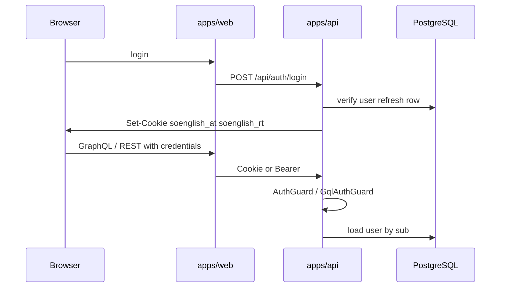

# Auth & RBAC

Authentication and authorization for SoEnglish. **Two parallel systems:** API/DB role checks (partial) and web UI permission matrix (client-side).

## Authentication flow

### Tokens & cookies

| Cookie | Purpose | TTL |
|--------|---------|-----|
| `soenglish_at` | JWT access token (httpOnly) | 30 min |
| `soenglish_rt` | Refresh token (httpOnly) | 30 days |

Implementation: `packages/backend/modules/module-auth/src/lib/auth-cookies.ts`, `AuthSessionService`.

- Access JWT payload: `{ sub: userId }` — **no role in token**
- Refresh tokens stored as SHA-256 hash in `AuthRefreshToken`

### Account provisioning

Public self-registration is **disabled**. New users are created only by administrators (or CLI for super-admin).

| Path | Resulting role |
|------|----------------|
| Admin `createAdminUser` / `POST /api/admin/users` | STUDENT (ADMIN) or student/teacher/admin (SUPER_ADMIN); optional profile fields; auto-generated password + welcome email |
| Google OAuth | **Existing users only** — links Google to a pre-provisioned email; unknown emails redirect to `/login?error=no_account` |
| `npm run super-admin` CLI | **SUPER_ADMIN** only |

Code: `createUserAsAdmin`, `upsertGoogleUser` in `module-auth/src/lib/auth.ts`.

### Session endpoints

- `POST /api/auth/login`, `refresh`, `logout`
- `GET /api/auth/me` — current user DTO
- Google sign-in: `/api/auth/google`, `/api/auth/google/callback`
- Google link (logged in): `/api/auth/google/link` → callback → Profile `?tab=connections&google_linked=1`
- Facebook link: `/api/auth/facebook/link` → callback → `facebook_linked=1` (env: `FACEBOOK_APP_ID`, `FACEBOOK_APP_SECRET`)
- Telegram link: `GET /api/auth/telegram/widget-config`; production uses Login Widget → `POST /api/auth/telegram/link` (`/setdomain` in @BotFather). **Localhost:** `POST /api/auth/telegram/link/start` → user opens `t.me/bot?start=link_<token>` → API dev long-polling completes link (`TELEGRAM_DEV_POLLING` or auto when `WEB_ORIGIN` is localhost).
- `myProfile.linkedAccounts` — connection status including `calendarConnected` for Google

## Authorization model (API)

**Pattern:** `AuthGuard` / `GqlAuthGuard` authenticate; **role checks are ad hoc** per handler.

| Mechanism | Location | Roles |
|-----------|----------|-------|
| `requireAdmin()` | `auth.ts`, `AdminResolver` | ADMIN, SUPER_ADMIN |
| `createUserAsAdmin` | `auth.ts` | ADMIN → student only; SUPER_ADMIN → student/teacher/admin |
| `UsersService.listStudents` | `users.service.ts` | TEACHER (own students), ADMIN/SUPER_ADMIN (all) |
| Lesson membership | `be-lessons.ts` | teacher or student on lesson |
| Most GraphQL mutations | `domain.resolvers.ts` | Authenticated only |

There is **no** shared `@Roles()` decorator or `RolesGuard`.

### SUPER_ADMIN via API

- Cannot create or delete SUPER_ADMIN via HTTP API
- Lifecycle: `scripts/super-admin.ts` with `SUPER_ADMIN_CLI_SECRET`

## Authorization model (Web UI)

| Layer | File | Behavior |
|-------|------|----------|
| Auth gate | `AuthGate.tsx` | Redirect unauthenticated → `/login` |
| Feature matrix | `mocks/roles.ts` | `canView`, `canEdit`, `canSchedule`, `canManage` per scope |
| Navigation | `Sidebar.tsx` | Hide `/students`, `/admin` by role |
| Pages | e.g. `admin/page.tsx` | Client empty state if disallowed |

Role mapping: `lib/active-user.ts` maps API `AuthUserDto.role` (snake string) → numeric `USER_ROLE` id from `@soenglish/shared-types`.

**Students** see all main nav except `/students` and `/admin`. **Teachers** see `/students`. **Admin/Super-admin** see `/admin`.

See [[concepts/roles-matrix]] for full comparison.

## Dual role representation

| Layer | Format | Example |
|-------|--------|---------|
| Prisma / Nest | Enum uppercase | `TEACHER` |
| API DTO | Lowercase snake | `teacher` |
| Web matrix | Numeric id 1–4 | `USER_ROLE.teacher.id === 2` |

## Account status

`UserAccountStatus`: ACTIVE, PAUSED, LEAVED, BLOCKED — stored on `User.status` but **not enforced** at login today.

## Known gaps

1. **No centralized RBAC** — duplicated `requireAdmin`; easy to miss on new endpoints
2. **Lesson create** — any authenticated user can set arbitrary `teacherId`/`studentId` (`be-lessons.ts`)
3. **Vocabulary** — `studentId` parameter without verifying actor is teacher/admin for that student
4. **Web routes** — no Next.js `middleware.ts`; `/admin` reachable by URL (API blocks mutations)
5. **Dashboard for ADMIN** — `DashboardService` filters lessons by `teacherId: user.id`; non-teaching admins get empty stats
6. **UI vs API mismatch** — matrix grants students `view` on calendar; API does not mirror all matrix rules
7. **Mocks blended with live auth** — some pages still use mock data paths (`active-user.ts` comments)
8. **BLOCKED/PAUSED** — no login rejection

## Related

- [[concepts/roles-matrix]]
- [[entities/user]]
- [[sources/2026-05-16-rbac]]
- Code: `packages/backend/modules/module-auth/`
