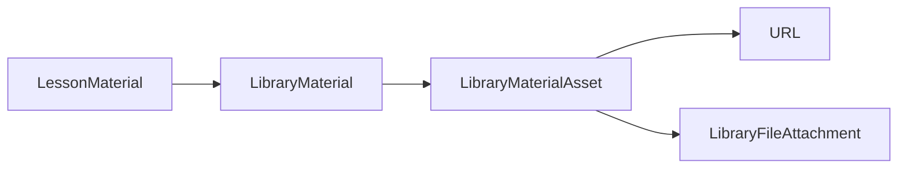

# Materials library

School-scoped content library for reusable teaching resources. Inspired by Edvibe-style materials (see [[concepts/redesign-plan]]); production UX in `apps/web/src/app/materials/`.

## Access

| Role | `/materials` tab | Attach to lesson | View on lesson |
|------|------------------|------------------|----------------|
| Teacher, Admin, Super admin | Yes (CRUD) | Yes | Yes |
| Student | No | No | Yes (via lesson materials) |

Route policy: `apps/web/src/lib/auth/route-policy.ts` — `/materials` staff-only; `/materials/view` all authenticated school roles.

## Data model

See [[entities/library-material]] and [[entities/lesson-material]].

## Web

- Page: `apps/web/src/app/materials/page.tsx`
- Feature: `apps/web/src/features/materials/`
- Store: `apps/web/src/stores/materials-store.ts`
- Lesson attach: `LibraryMaterialPicker` in `LessonContentTab`; linked items render in `LessonLibraryMaterialPanel` (cover, kind badge, asset chips). **Students** see only student-facing assets (`student_book`, `workbook`, `audio`, etc.) — **`teacher_book` is staff-only**. Staff see a separate **Teacher only** group. **Audio & video** are **opt-in per lesson**: `LessonMaterial.sharedLibraryAssetIds` + `libraryMediaSelectionApplied` (new attaches default to selection mode with none checked; legacy rows with `libraryMediaSelectionApplied=false` still share all optional media). Staff toggle checkboxes in the lesson materials panel. Library attach maps kind → lesson material kind (`book`, `board`, `presentation`, …). Manual material type row: Text, Photo, Book, Board, File, Presentation (no Test).
- Create/edit modal: `MaterialFormModal` — file assets use `Field as="file-button"` (same pattern as homework/student response in `LessonContentTab`); chips + remove match lesson modal styles. Rendered via `BodyPortal` (`--z-modal`) so overlay stacks above header. Tags use shared `TagInput` (`components/ui/TagInput.tsx`): chip list + Enter/comma to add, suggestions from tags already used in the loaded library list (`tag-list.ts` helpers). **Level** is a select from `@pkg/types` `PROFICIENCY_LEVEL` (A1–C2), stored as code string; helpers in `lib/proficiency-level.ts`. File upload **`accept`** and validation follow asset **Role** via `material-asset-file-policy.ts`. **Audio / Video / Slides** allow **multiple files** per asset row (each file → one backend asset). **Link** is **URL-only** (no file delivery). **Cover image** — optional `coverAttachmentId` on `LibraryMaterial` (upload image in form). **Book PDF previews** — for `student_book`, `teacher_book`, `workbook` assets, server renders first PDF page via Ghostscript into `LibraryFileAttachment.previewStorageKey`; exposed as `previewDownloadPath` on assets. Cards prefer material cover, then student → teacher → workbook preview. **MaterialCard** — **Grid**: compact equal-size tiles with clickable file chips; **List**: horizontal rows with inline file chips. File chips and form file rows link to `/api/materials/files/{id}`.
- Form persistence: `material-form-utils.ts` — URL-only creates in one GraphQL call; pending uploads create → REST upload → update with `fileAttachmentId`. `MaterialFormModal` shows step list + overall progress (XHR upload bytes) via `MaterialSaveProgressPanel`. After bytes are sent, a **Compressing** step reflects server-side optimization (sharp / ffmpeg / Ghostscript) before the API responds. During save, `useNavigationLock` warns on browser Back / tab close; interrupted uploads are tracked in `sessionStorage` (`material-save-recovery.ts`) and the `/materials` page shows a recovery banner. The list keeps cached data visible while refetching (no blank screen on return).
- **In-app book viewer** — PDF book assets (`student_book`, `teacher_book`, `workbook`) open at `/materials/view/[fileAttachmentId]` with pdf.js + Konva overlay. PDF via `fetch` + `ArrayBuffer` (auth cookies); worker at `public/pdfjs/pdf.worker.min.mjs`. In-flight page renders are cancelled before re-render (avoids canvas reuse error). Initial scale **fit-to-width** (max ~920px, never upscaled above 1:1); user zoom multiplier 0.5–2.5. Page jump input + first/last buttons; keyboard: PageUp/Down, Home/End, Alt+arrows, Ctrl/Cmd+Z undo. Theme-aware `--surface` canvas background. **Text annotations:** create with Text tool; **Select** tool to drag + resize (Transformer, scales fontSize); double-click or Text tool to edit; textarea resize syncs box size. Annotations per `(userId, fileAttachmentId, contextUserId)`; staff overlay + **Remove my additions**. See [[entities/library-file-user-annotation]].
- **In-app media viewer** — Audio and video open in a **modal popup** (`MediaViewerModal` via `MaterialAssetLink` → `openMediaViewer`). Same Plyr player + session notes inside the dialog; Esc / backdrop / X to close (confirm if notes exist). **Session notes** prepend newest at top. Plyr speed menu opens downward to avoid modal overflow clip. PDF books still use full-page `/materials/view/[fileAttachmentId]`. Deep links to audio/video `/materials/view/...` redirect back and open the modal. File API supports **HTTP Range** for scrubbing.
- **Lesson audio/video sharing (staff)** — Single compact block **Audio & video for student** with **Audio** / **Video** subsections: checkbox share + inline Play preview per row (no duplicate Preview group).
- Lesson materials panel: staff **edit mode** shows `OptionalMediaPicker` (sharing checkboxes) **and** Preview links per audio/video row; staff preview sees all optional media, not only shared-with-student items.

## Backend

- Module: `@be/materials` (`packages/backend/modules/module-materials`)
- Pagination: cursor on `updatedAt|id`, default `take=24`
- Search: title + description (case-insensitive)

## Env

- `MATERIAL_UPLOAD_DIR` (default `data/material-uploads`)
- `MATERIAL_ATTACHMENT_MAX_BYTES` (default 100 MB)

### On-disk layout

Files are stored under `{MATERIAL_UPLOAD_DIR}/library/{materialId}/{attachmentId}{ext}` — one folder per material, not flat UUID blobs at the upload root. Legacy flat keys still resolve for existing uploads. On material delete, individual files and the material directory are removed.

### Upload compression

On `POST /api/materials/files/:materialId`, the API compresses when enabled (`MATERIAL_COMPRESS_ENABLED`, default on). Optional query **`compressLevel`**: `off` | `light` | `balanced` (default) | `strong` — chosen in the material form **File compression** select; applies to PDF/images/audio/video for that upload batch.

| Level | PDF (Ghostscript) | Typical use |
|-------|---------------------|-------------|
| **off** | No compression | Archival / already optimized |
| **light** | `/printer`, ~200 dpi | Best quality, larger files |
| **balanced** | `/ebook`, ~150 dpi | Default for school materials |
| **strong** | `/screen`, ~96 dpi | Smallest files, lower quality |

**PDFs** (`MATERIAL_DEFER_PDF_COMPRESS`, default on): the upload responds immediately after the raw file is stored (`compressionCodec: background`); Ghostscript runs asynchronously with the selected level so the Next.js `/api` proxy does not time out on 50–100 MB books. Images/audio/video still compress synchronously in the request when not deferred (usually fast).

| Kind | Tool | Output |
|------|------|--------|
| Images (jpeg/png/webp/heic, not svg/gif anim) | `sharp` (npm) | WebP or JPEG if smaller |
| Audio | `ffmpeg` (optional CLI) | MP3 128k |
| Video | `ffmpeg` | H.264 MP4 |
| PDF | Ghostscript `gs` (**required CLI** for PDF compression) | `/ebook` profile + image downsample (`MATERIAL_PDF_IMAGE_DPI`, default 150); **deferred** by default |

If Ghostscript/ffmpeg is missing, the original bytes are stored and the API logs a startup warning. Install on macOS: `brew install ghostscript ffmpeg`. If output is not smaller after compression, the original is kept. Book title-page preview generation after save is also non-blocking (failures are logged, save still succeeds).

### Auto captions (audio / video) — deferred in UI

Backend pipeline exists (`LibraryFileCaptionService`, Whisper local/cloud) but **UI is hidden** and auto-generation defaults **off** (`MATERIAL_CAPTIONS_ENABLED` must be `true` to enqueue). Re-enable System panel + player subtitle controls when ready. See [[entities/library-file-caption-track]].

## Future (multi-tenant)

`LibraryMaterial.schoolId` is nullable now; populate when `School` tenant model lands.
