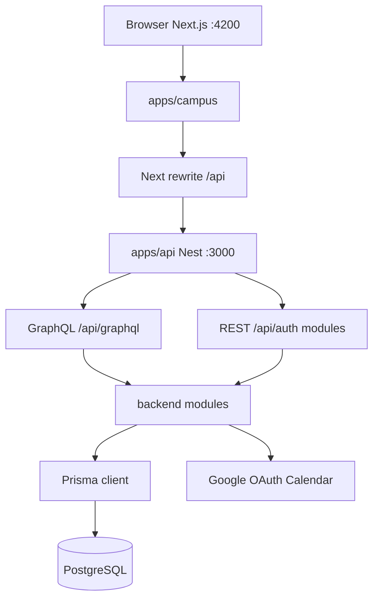
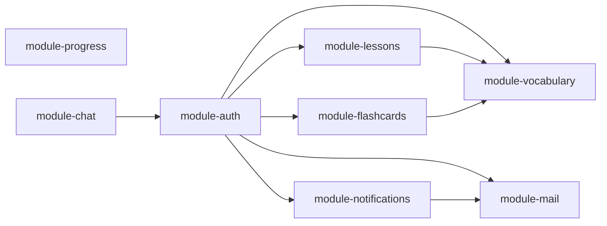

# Architecture synthesis

## System context

## Layering

| Layer | Location | Responsibility |
|-------|----------|----------------|
| Presentation | `apps/campus` | Pages, components, Zustand stores, GraphQL operations |
| API gateway | `apps/api` | `GraphQLModule` bootstrap, global `/api` prefix, imports `@be/*` |
| Domain | `packages/backend/modules/*` | Business logic, REST controllers, GraphQL resolvers (`presentation/`) |
| Shared GraphQL types | `packages/backend/shared/graphql` (`@be/graphql`) | Code-first ObjectTypes / Inputs |
| Data access | `data-access/data-access-prisma` | Prisma schema + `PrismaModule` |
| Shared contracts | `packages/shared/types` | DTOs shared by web and API |

## GraphQL vs REST

| Surface | Used for |
|---------|----------|
| **REST** `@Controller('auth')` | Login, refresh, logout, me, Google OAuth (existing users), `/admin/users` |
| **REST** module controllers | Lessons, vocabulary, flashcards, progress (under `/api/...`) |
| **GraphQL** | Dashboard, vocabulary, quizzes, lessons queries/mutations, students, admin users |

Resolver map: [[concepts/graphql-api]]. Resolvers live in `@be/*` modules; see [[concepts/backend-modules]].

## Module boundaries

- **Auth** — identity, sessions, admin user CRUD, dashboard, student listing, dashboard GraphQL
- **Lessons** — `ScheduledLesson` CRUD, Google Calendar/Meet
- **Vocabulary** — `Word`, `StudentWordCard`, dictionary enrichment
- **Flashcards** — `Quiz`, assignments, attempts (despite name, quiz domain)
- **Progress** — calendar REST events for scheduled lessons
- **Chat** — Socket.IO + REST messaging
- **Mail** — SMTP, password helpers, email templates
- **Notifications** — cron, Telegram, streaks, teacher messages

## Web architecture

- App Router under `apps/campus/src/app/`
- Shared UI primitives: `apps/campus/src/components/ui/` — [[concepts/ui-design-system]]
- Feature modules: `apps/campus/src/features/` (lesson-modal, calendar)
- Auth routing is request-time now: `apps/campus/src/proxy.ts` classifies route surfaces, asks backend `GET /api/auth/web-session`, redirects anonymous protected requests before render, performs coarse role/scope gating for top-level route surfaces, and forwards normalized auth headers into the server render pass.
- The same request-time path now carries account-status denial codes (`account_paused`, `account_leaved`, `account_blocked`) from backend `web-session` to middleware redirects, so blocked sessions land on `/login` with a specific reason instead of a generic auth failure.
- Root layout reads that request auth state and chooses shell structure server-side (`auth` pages render without `AppShell`; protected routes render inside it), so layout ownership no longer depends on pathname checks inside a client shell component.
- Client auth remains a UI cache/store seeded from server-resolved session data; it still owns explicit `login/logout/refresh` actions but not first navigation access control.
- Route visibility for high-level app sections now shares the same pathname policy between middleware and sidebar navigation, reducing drift between request-time redirects and client nav hiding; redundant top-level page-entry guards and the old `AuthGate` shim were removed where middleware already owns the surface.
- Product scope is still effectively single-school today, but new architecture work is expected to preserve a clean future path toward **platform-level control** (marketplace, subscriptions, commission) plus **school-level tenant contexts** — see [[synthesis/product#Today vs target platform]] and `.cursor/rules/future-multitenant-architecture.mdc`.

## Auth architecture (summary)

JWT in httpOnly cookies; guards attach `user.id` only. Request-time auth uses a non-mutating backend `web-session` snapshot to decide coarse route access without rotating cookies in middleware. The snapshot now also exposes `availableScopes` so future platform-vs-school routing can be additive. Auth/session boundaries enforce `User.status === ACTIVE`, while detailed ownership checks remain in backend services (for example student-scoped vocabulary access and lesson create/update rules) because JWT access tokens still carry only `sub` — [[concepts/auth-rbac]].

## Known architectural gaps

Documented in [[concepts/auth-rbac#Known gaps]] — no central RBAC, uneven enforcement across modules.

## Related

- [[synthesis/tech-stack]]
- [[synthesis/product]]
- [[overview]]
