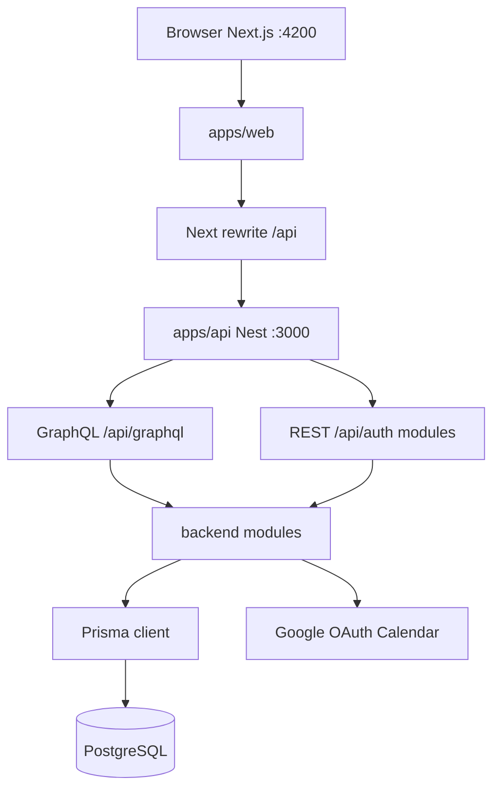
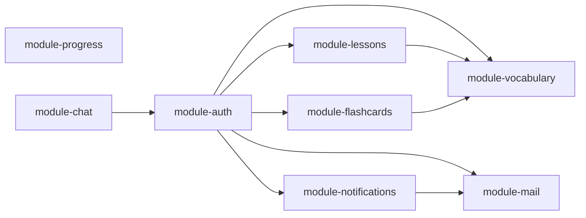

# Architecture synthesis

## System context

## Layering

| Layer | Location | Responsibility |
|-------|----------|----------------|
| Presentation | `apps/web` | Pages, components, Zustand stores, GraphQL operations |
| API gateway | `apps/api` | `GraphQLModule` bootstrap, global `/api` prefix, imports `@be/*` |
| Domain | `packages/backend/modules/*` | Business logic, REST controllers, GraphQL resolvers (`presentation/`) |
| Shared GraphQL types | `packages/backend/shared/graphql` (`@be/graphql`) | Code-first ObjectTypes / Inputs |
| Data access | `data-access/data-access-prisma` | Prisma schema + `PrismaModule` |
| Shared contracts | `packages/shared/types` | DTOs shared by web and API |

## GraphQL vs REST

| Surface | Used for |
|---------|----------|
| **REST** `@Controller('auth')` | Login, refresh, logout, me, Google OAuth (existing users), `/admin/users` |
| **REST** module controllers | Lessons, vocabulary, flashcards, progress (under `/api/...`) |
| **GraphQL** | Dashboard, vocabulary, quizzes, lessons queries/mutations, students, admin users |

Resolver map: [[concepts/graphql-api]]. Resolvers live in `@be/*` modules; see [[concepts/backend-modules]].

## Module boundaries

- **Auth** — identity, sessions, admin user CRUD, dashboard, student listing, dashboard GraphQL
- **Lessons** — `ScheduledLesson` CRUD, Google Calendar/Meet
- **Vocabulary** — `Word`, `StudentWordCard`, dictionary enrichment
- **Flashcards** — `Quiz`, assignments, attempts (despite name, quiz domain)
- **Progress** — calendar REST events for scheduled lessons
- **Chat** — Socket.IO + REST messaging
- **Mail** — SMTP, password helpers, email templates
- **Notifications** — cron, Telegram, streaks, teacher messages

## Web architecture

- App Router under `apps/web/src/app/`
- Shared UI primitives: `apps/web/src/components/ui/` — [[concepts/ui-design-system]]
- Feature modules: `apps/web/src/features/` (lesson-modal, calendar)
- Auth: client `AuthGate` + cookie credentials — [[concepts/web-app]]

## Auth architecture (summary)

JWT in httpOnly cookies; guards attach `user.id` only. Role checks are **ad hoc** per endpoint — [[concepts/auth-rbac]].

## Known architectural gaps

Documented in [[concepts/auth-rbac#Known gaps]] — no central RBAC, uneven enforcement across modules.

## Related

- [[synthesis/tech-stack]]
- [[synthesis/product]]
- [[overview]]
