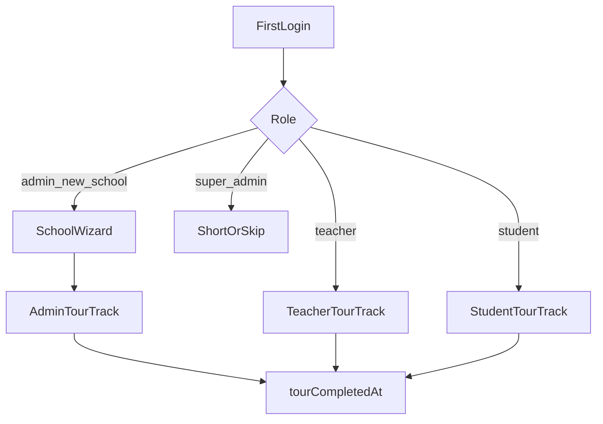
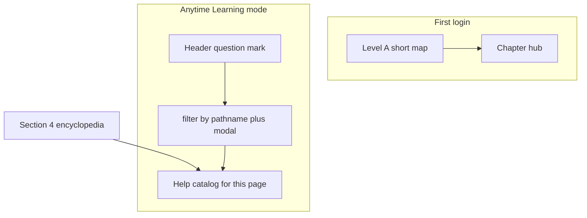

# Role-based Arvi onboarding journey — Technical Specification (SPARC)

> **Status:** Stages 1–7 shipped (Tour v2–v3); **Stage 8 Help encyclopedia shipped (2026-07-20)** — Header `?` = page Help (§4.13)  
> **SPARC phase:** Specification (+ Stages 1–8 Refinement)  
> **Scope:** requirements + phased implementation. Stages 1–6: `apps/campus/src/components/tour/`, mascot SFX, `data-tour-anchor`, Level B quests. Stage 7: chapter hub + soft scenarios. Stage 8: Help catalogs + Learning mode Header `?`.  
> **Product UI copy language:** English (current app). Column **UA intent** is for future i18n (G33), not shipped strings.  
> **Companion:** Phase 4.5 in `docs/multi-tenant-execution-plan.md` (CLOSED); this is a **new workstream** on top of the existing ProductTour.  
> **Ground truth:** `apps/campus` routes + `route-policy.ts` + `sidebar-nav.tsx` + `docs/e2e-journey-test-plan.md` stages 3–6 + wiki concepts.

---

## 0. Goal, non-goals, glossary

### Goal

When a **student**, **teacher**, **school admin**, or (optionally) platform operator opens the school app **for the first time**, they get a **role-specific guided story** led by **Arvi**:

1. A spotlight / callout window next to each relevant **nav item or page section** (`data-tour-nav` / `data-tour-anchor`).
2. Arvi in the tour card (pose per step) with **short SFX** (v1) and a mute control.
3. A plot that walks them through **what they can try on each surface** — not a generic admin tour for every role.
4. Enough product detail in this TZ that implementers can write copy and anchors **without rediscovering the app**.

### Non-goals

- Replace the **school signup wizard** (`/onboarding`, `School.onboardingState`).
- Marketplace / recruiting tours (Phase 6 deferred).
- Full TTS / Meshy voice-over of every line in v1 (seam only — Stage 6).
- Blocking the app until the tour finishes (**Skip** always available).
- Changing multi-tenant isolation or billing entitlements.
- Teaching every System provider form field (admin tour = map of tabs, not a second wizard).
- Inventing routes that do not exist (there is **no** `/homework` — homework lives on lessons).

### Glossary

| Term | Meaning |
|------|---------|
| **School wizard** | Post-`register-school` 5-step config (`School.onboardingState`). ADMIN only. Path `/onboarding`. |
| **Product tour (today)** | Single `TOUR_STEPS` overlay; not role-filtered. Gated by `User.tourCompletedAt`. |
| **Tour track** | Role-specific step list: `student` \| `teacher` \| `admin` (+ optional `admin_platform`). |
| **Level A** | Guided spotlight tour (Next / Back / Skip). Short product map. **Shipped.** |
| **Level B / Chapters** | Soft try-it scenarios after Level A hub. Soft-skip always. **Tour v3.** |
| **Help catalog** | Page-scoped encyclopedia steps (`help-*`) for Header `?` when Learning mode is on. **Not** Level A — does not reset `tourCompletedAt`. Full copy in §4.13. |
| **Deep journey** | E2E audit scenarios in `docs/e2e-journey-test-plan.md` — QA depth, not the tour script. |
| **Surface** | A route or major in-page region the user can act on (dashboard hero, practice hub card, System tab, …). |
| **Anchor** | DOM hook `data-tour-anchor="…"` for spotlight when nav alone is insufficient. |

---

## 1. UX principles

1. **Arvi is the guide** — warm coach, concise, celebrates small wins (persona: Speaker-puff).
2. **One window at a time** — single tour card + optional spotlight; no stacked modals.
3. **Role-true targets** — never spotlight a nav item the role cannot see (RBAC / `route-policy` + `useVisibleNavSections`).
4. **Explain each section on each page (full product tour)** — first-login / Replay walk `getFullProductTourSteps`: welcome → **every Help catalog step** (page by page, section by section) → done. Header `?` still opens **page-scoped** Help only. Chapters remain soft try-its after Finish.
5. **Skip & replay** — Skip anytime; Profile → Account → **Replay tour** and **first login** (`tourCompletedAt` null) share `beginFullProductTour()`: reset chapters, open Level A from step 0, navigate to `/dashboard`. Header `?` is Help (page tips), not Replay.
6. **Wizard first** — on `/onboarding`, tour must not open (already true).
7. **Corner Arvi hidden** while tour open (`setSlotVisible(false)` — already true).
8. **a11y** — `role="dialog"`, focus trap, Escape = Skip confirm or close, labels, contrast; respect `prefers-reduced-motion` (static pose + **SFX muted by default** when reduce is on).
9. **Perf** — no voice download on first paint; SFX lazy after first interaction or tour open; 3D mascot already lazy.
10. **School-agnostic copy** — no hard-coded school name; branding via CSS tokens (G18).
11. **Level A soft auto-nav** — when a Level A step has `navHref` and the user is on another route, ProductTour soft-`router.push`es there so the long map walks all pages. **Chapters** stay try-it: pathname-only “open X” steps require a user click; soft-nav only to show an on-page target (`anchorId` / selector / event). Help / first-words never auto-nav.
12. **Money vocabulary is role-scoped** — student `/payment` ≠ school `/billing` ≠ System → Payments ≠ `/finance` payouts. Tour copy must never conflate them.

---

## 2. Actors, RBAC surface map, first-login triggers

### 2.1 Actors

| Actor | Auth role key | First-login path | Tour track |
|-------|---------------|------------------|------------|
| Learner | `student` | Invite / admin-created → login → `/dashboard` | `student` |
| Teacher | `teacher` | Invite → login → `/dashboard` | `teacher` |
| School admin | `admin` | Signup → **wizard** → `/dashboard` **or** invite → `/dashboard` | `admin` |
| Super admin (school app) | `super_admin` | Rare in school app; usually platform console | **Full `admin` track** in Campus (same Level A + chapters as school admin). Short `admin_platform` stub kept in code for docs/CMS only. |
| Platform operator | Platform console (`apps/platform`) | Out of scope for school ProductTour | N/A |

### 2.2 Nav visibility (source of truth)

From `sidebar-nav.tsx` + `canRoleAccessPathname` / `route-policy.ts`:

| Nav href | Label (nav) | student | teacher | admin | super_admin |
|----------|-------------|---------|---------|-------|-------------|
| `/dashboard` | Dashboard | ✓ | ✓ | ✓ | ✓ |
| `/lessons` | Lessons | ✓ | ✓ | ✓ | ✓ |
| `/practice` | Practice | ✓ | ✓ | ✓ | ✓ |
| `/materials` | Materials | — | ✓ | ✓ | ✓ |
| `/calendar` | Calendar | ✓ | ✓ | ✓ | ✓ |
| `/chat` | Chat | ✓ | ✓ | ✓ | ✓ |
| `/students` | Students / Students & Groups* | — | ✓ | ✓ | ✓ |
| `/staff` | Staff | — | — | ✓ | ✓ |
| `/payment` | Payment | ✓ | — | — | — |
| `/finance` | Finance | — | — | ✓ | ✓ |
| `/billing` | Subscription | — | — | ✓ | ✓ |
| `/profile` | Profile & Settings | ✓ | ✓ | ✓ | ✓ |
| `/admin` | Admin | — | — | ✓ | ✓ |
| `/system` | System | — | — | ✓ | ✓ |

\*Label becomes **Students & Groups** when `groupLessons.enabled` (System → General).

**Also reachable but not always in sidebar:**

| Path | Who | Notes |
|------|-----|-------|
| `/vocabulary` | all | Alias of practice vocabulary; also header search `?q=` |
| `/quiz` | all | Alias of `/practice/quiz` |
| `/practice/speaking`, `/practice/irregular-verbs` | all | Hub cards |
| `/lessons/[id]` | participants | Lesson room |
| `/materials/view/[attachmentId]` | all (incl. student) | Book viewer from lesson attach — **not** library list |
| `/students/[id]` | teacher+ | Student OS |
| `/staff/[userId]` | admin+ | Staff detail |
| `/onboarding` | admin (wizard) | **Tour suppressed** |
| `/platform/*` | super_admin | Platform app — no school tour |

### 2.3 Trigger rules

```
IF pathname starts with /onboarding → do not open tour
ELSE IF user.tourCompletedAt is null → beginFullProductTour() (dashboard + Level A soft auto-nav → hub → soft chapters)
ELSE → idle (Help can replay)
```

### 2.4 Use cases

| ID | Actor | Use case | Success |
|----|-------|----------|---------|
| UC1 | Student | Complete Level A student track | `tourCompletedAt` set; saw practice/payment, not billing/staff |
| UC2 | Teacher | Complete Level A teacher track | Saw materials/students; not `/payment` |
| UC3 | Admin | Finish wizard then Level A admin track | No duplicate wizard content; saw billing/system |
| UC4 | Any | Skip tour | Completed flag set; no forced return until Replay |
| UC5 | Any | Replay from Help | Tour reopens from step 0 for their track |
| UC6 | Any | Mute SFX | Preference persists (`localStorage`); no voice in v1 |
| UC7 | Student | Understand homework lives on lessons | No `/homework` step |
| UC8 | Admin | Distinguish Subscription vs student Payment vs System Payments | Copy uses correct nouns |
| UC9 | Any | Complete or soft-skip a chapter from hub | Chapter status `done`/`skipped` in localStorage; can Finish later |
| UC10 | Teacher | Soft-complete First lesson chapter | Lesson modal open detected; cancel without save OK |


### 2.5 Gherkin (acceptance samples)

```gherkin
Feature: Role-based first-login tour
  Scenario: Student does not see admin billing step
    Given a student with tourCompletedAt null
    When the product tour opens
    Then the track is "student"
    And no step targets "/billing" or "/staff" or "/materials" or "/students"

  Scenario: Tour skipped on wizard route
    Given an admin on "/onboarding"
    When the app loads ProductTour
    Then the tour overlay is not shown

  Scenario: Spotlight only on visible nav
    Given a student on the "payment" step
    When the spotlight measures the target
    Then "[data-tour-nav='/payment']" exists and is visible

  Scenario: Teacher never sees Payment nav step
    Given a teacher with tourCompletedAt null
    When the product tour opens
    Then no step targets "/payment"
```

---

## 3. Product model: TourTrack + steps + progress



### Step schema (target TypeScript shape)

```ts
type TourTrackId = 'student' | 'teacher' | 'admin' | 'admin_platform';

type TourSfx = 'greet' | 'point' | 'celebrate' | 'encourage' | 'click' | 'wave' | 'none';

type TourTarget =
  | { kind: 'nav'; href: string }           // data-tour-nav
  | { kind: 'anchor'; id: string }         // data-tour-anchor="..."
  | { kind: 'none' };                      // centered card (welcome/done)

interface TourStepDef {
  id: string;
  level: 'A' | 'B';
  title: string;
  body: string;
  /** Short UA meaning for translators (not shown in UI). */
  uaIntent?: string;
  /** Longer coach script / design notes — not shown in UI unless product enables “More”. */
  coachNotes?: string;
  area?: string;
  target: TourTarget;
  pose: 'idle' | 'greet' | 'point' | 'celebrate' | 'think' | 'encourage' | 'sleep' | 'wave';
  sfx?: TourSfx;
  cta?: 'next' | 'finish' | 'soft_skip';
  /** Surfaces this step is teaching (for QA / docs). */
  teaches?: string[];
  /** Level B: user must perform action or soft-skip. */
  requiresAction?: {
    id: string;
    hint: string;
    detect: 'pathname' | 'selector' | 'event';
    value: string;
  };
}
```

### Progress storage

| Field | Tour v2 | Tour v3 (Stage 7) |
|-------|---------|-------------------|
| `User.tourCompletedAt` | Level A done / skip | Same — set when hub Finish later, Skip tour, or all chapters resolved |
| `User.tourProgress` (Json) | Optional (deferred) | **Still deferred** — not required |
| Client `localStorage` | `arvi.sfxMuted` | + `arvilio.tour.chapters.{userId}.{track}` → `{ [chapterId]: 'done'\|'skipped' }` |

**Track selection:** client from `user.role` (map `super_admin` → `admin_platform` or skip). API may return `{ completed, track }` for analytics consistency.

### Levels (three layers)

| Layer | When | UX | Resets tour? |
|-------|------|-----|--------------|
| **A — Guided spotlight** | First login (`tourCompletedAt` null) | Short role map; Next/Back/Skip/Finish → hub | Sets complete on finish/skip |
| **Hub + Chapters** | After Level A Finish | Soft scenarios; cancel OK | Chapter LS only |
| **Help catalog** | Learning mode ON; Header `?` anytime | **All §4 sections for the current page** (filter by `navHref` / modal `anchorId`) | **No** — no `/tour/reset` or `/complete` |
| **Replay** | Profile → Account | Full Level A again | Yes — clears completion + chapter LS |

**Working checklist:** [`docs/tour-v3-chapters.md`](./tour-v3-chapters.md) · Help copy: **§4.13**



### Recommended Level A length

| Track | Max steps | Rationale |
|-------|-----------|-----------|
| student | 12 | Practice has many learning surfaces; keep bodies short |
| teacher | 11 | Ops + materials + students |
| admin | 12 | Ops map after wizard; System = one step |
| admin_platform | 3–4 | Zero friction |

---

## 4. Product surface encyclopedia (all roles)

This section is the **canonical feature map** for tour authors. Role plots in §5–7 pick subsets and write EN copy.

### 4.1 School wizard `/onboarding` (NOT ProductTour)

| Step | What user configures | Tour implication |
|------|----------------------|------------------|
| 1 School profile | Timezone, locale (uk/en), accent color | Do **not** re-teach in admin tour |
| 2 Teaching setup | Languages taught, default lesson format (online / in-person / hybrid) | Mention only if Groups/format matter later |
| 3 Payments | Enable methods from billing payment-settings (or “configure later”) | Admin tour points to **System → Payments** for deep config, **Billing** for SaaS plan |
| 4 Invite teammates | Emails one per line | Admin tour can quest “invite someone” via Students/Admin |
| 5 Sample content | Seed demo lessons & materials yes/no | Empty-state copy may differ if sample skipped |

**Actions:** Skip (non-last), Save & continue, Finish → `/dashboard`.

---

### 4.2 `/dashboard`

| | |
|--|--|
| **Roles** | All (layout differs student vs staff) |
| **Purpose** | Daily hub from live GraphQL (`dashboardSummary`, lessons, vocab, streak) |
| **Student sections** | Greeting + streak/date; **hero** (next lesson / vocab review / practice CTA); stat tiles (vocab cards, lessons today, completed); quick actions (Calendar, Practice, Vocabulary, Chat, Quizzes); Today’s lessons; Coming up; Review words; Daily goals; Word of the day; Irregular verb of the day; Streak calendar |
| **Staff sections** | Greeting + date; hero; tiles (students, lessons today, homework to review); quick actions (+ Students, New lesson); Today’s / week list; Homework to review; My students; Lessons this month |
| **Admin-only widget** | `EntitlementsWidget` — plan seats/storage (mirrors `/billing`) |
| **Key actions** | Open lesson; review words → `/vocabulary`; practice; create lesson (staff modal); jump via quick actions |
| **Empty / gotchas** | “No lessons today”; “All caught up”; Arvi greets then idle; no mock data |
| **Suggested anchors** | `dash-hero`, `dash-quick-actions`, `dash-daily-goals` (student), `dash-homework-review` (staff), `dash-entitlements` (admin) |

---

### 4.3 `/lessons` + `/lessons/[id]`

| | |
|--|--|
| **Roles** | All (scoped to lessons the viewer is on) |
| **List purpose** | Course schedule list — upcoming/past, homework status; **not** the calendar grid |
| **List sections** | Highlights (next + previous with materials count + homework badge); stats (planned/completed/cancelled); paginated list + status filter; staff create/edit modal |
| **Lesson room** | Sidebar: identity, schedule & people, Join Meet/Zoom/LiveKit, save / submit homework, brief; main: plan, materials, library attach, homework, student response, feedback; student vocab add; previous-lesson context |
| **Key actions** | Open calendar; open detail; staff edit/create; join video; student submit homework (**only after lesson completed**); staff review/accept; attach library materials (staff) |
| **Empty / gotchas** | Planned homework shows “Opens after the lesson”; video needs provider ready; `teacher_book` assets staff-only; **no `/homework` route** |
| **Suggested anchors** | `lessons-highlights`, `lessons-list`, `lesson-join-video`, `lesson-homework` |

---

### 4.4 `/practice` hub + submodes

| Surface | Purpose | Key actions | Gotchas |
|---------|---------|-------------|---------|
| `/practice` | Hub: activity cards + week stats | Open Vocabulary / Quiz / Speaking / Irregular verbs | **Games** & **Challenges** = “Coming soon” — tour must not promise them; nav badge = quizzes incomplete + vocab due + speaking pending |
| `/vocabulary` (= `/practice/vocabulary`) | Word cards: list / flashcards / Play MCQ | Add word; filters; Play (≥2 cards); `?q=` from header | Empty deck; Play needs enough cards |
| `/quiz` (= `/practice/quiz`) | Assigned/self quizzes | Start Quiz (persists) vs Practice (no persist); staff generate | Wrong answers can promote cards to mistakes_work |
| `/practice/speaking` | Topics + record + teacher feedback | Create topic; MediaRecorder; staff review | Mic permission; empty “No speaking topics yet” |
| `/practice/irregular-verbs` | Global verb table + Three Forms Drill | Browse tiers; run drill | Results **not** saved to vocabulary deck; counts toward practice week time |

**Suggested anchors:** `practice-hub-cards`, `practice-stats`, `vocab-mode-toggle`, `quiz-hero`, `speaking-record`, `irregular-play`.

---

### 4.5 `/calendar`

| | |
|--|--|
| **Roles** | All; create/DnD/resize = teacher+ (`canSchedule`) |
| **Purpose** | Month/week schedule board |
| **Sections** | Week/month toggle; navigator; admin audience (all / my-students) + teacher filter; grid; selected-date sidebar; lesson modal; conflict/delete/series dialogs |
| **Student actions** | Browse; open lesson; **Request lesson** → `/chat?peer=teacher` |
| **Staff actions** | Create/edit/move/resize; series unlink/delete planned |
| **Gotchas** | Past slots blocked; recurrence client-expanded; colors from student `displayColor`; timezone = viewer profile; deep link `?date=&lessonId=&focus=1` |
| **Suggested anchors** | `calendar-toolbar`, `calendar-grid`, `calendar-request-lesson` (student) |

---

### 4.6 `/chat`

| | |
|--|--|
| **Roles** | All (visibility rules differ) |
| **Purpose** | Realtime DMs (+ admin group chats) |
| **Sections** | Inbox; thread; New message; Create group (**admin/super_admin**); attachments (24h TTL) |
| **Visibility** | Students: assigned/lesson teachers + admins; Teachers: assigned/lesson students + admins |
| **Gotchas** | Mobile inbox/thread swap; unread badge on nav; attachments expire |
| **Suggested anchors** | `chat-inbox`, `chat-composer`, `chat-new-message` |

---

### 4.7 `/payment` (student only)

| | |
|--|--|
| **Roles** | **student only** |
| **Purpose** | Prepaid **lesson balance** + package checkout / manual invoice (**Layer A** student→school money) |
| **Sections** | Balance card (individual and/or group by `lessonFormat`); package selector; online methods; manual invoice (IBAN etc.); ledger activity |
| **Gotchas** | Packages only if school enabled self-serve + methods configured in **System → Payments**; `?status=success\|cancelled`; **never** call this “Subscription” |
| **Suggested anchors** | `payment-balance`, `payment-packages`, `payment-methods` |

---

### 4.8 `/profile`

| Tab | What it does |
|-----|----------------|
| Profile | Name, avatar, languages, timezone, etc. |
| Statistics | Learner vs staff layout metrics |
| Notifications | Email / in-app prefs |
| Connections | Google / Zoom / Telegram / Facebook OAuth links (needed for Meet/Zoom hosting) |
| Appearance | Theme / font size |
| Achievements | Badges / counters |
| Account | Password, logout (Arvi `wave`) |

**Tour:** one step pointing at nav; optionally mention Connections for teachers who host video. **Replay tour** lives under Help (product), not a Profile tab.

---

### 4.9 `/materials` + viewer

| | |
|--|--|
| **Roles** | Library list: teacher+; `/materials/view/[id]`: all (lesson-linked) |
| **Purpose** | School library — boards, presentations, books, media; attach to lessons |
| **Actions** | CRUD; upload ≤100MB; book annotator; media modal; recovery banner for interrupted uploads |
| **Gotchas** | Storage quota (entitlements); students do **not** browse library — they open files from lessons |
| **Suggested anchors** | `materials-grid`, `materials-create` |

---

### 4.10 `/students` + `/students/[id]` + groups

| Surface | Purpose |
|---------|---------|
| `/students` | Roster cards; if group lessons on: Students \| Groups switcher |
| Groups panel | CRUD templates/members (admin-heavy); teachers schedule by named group |
| `/students/[id]` | Tabs: Profile \| Statistics \| Lessons \| Billing \| Achievements \| Practice (Vocabulary \| Quiz \| Speaking) |
| Student Billing tab | Admin adjusts balance; **teachers hide student pricing** |
| Practice tab | Teachers assign vocab/quiz/speaking |

**Gotchas:** Teacher empty “No students assigned to you”; legacy `/students/groups` → `/students?view=groups`.

**Suggested anchors:** `students-list`, `students-groups-tab`, `student-practice-tab`, `student-billing-tab`.

---

### 4.11 `/staff` + `/finance` + `/admin` + `/billing`

| Route | Money / people meaning | Tour noun |
|-------|------------------------|-----------|
| `/staff` | Staff roster + compensation / earnings per person | “Staff pay settings” |
| `/finance` | School-wide payout ops, charts, record payout | “Payouts to teachers” |
| `/admin` | Create/delete accounts; student import; seat caps | “Create accounts” |
| `/billing` | School → platform **SaaS subscription** (Layer B): plan, seats, storage, promo | “School subscription” |

**Do not confuse with:** student `/payment`, System → Payments (provider secrets + packages).

---

### 4.12 `/system` (8 tabs)

| Tab | Teaches | Tour depth |
|-----|---------|------------|
| General | Group lessons toggle; video meetings provider panel | Mention group lessons → Students & Groups |
| Email | SMTP status / test welcome | Point only |
| Word dictionary | Dictionary + translation providers | Point only |
| Connections | Google, Zoom, LiveKit, etc. | Point — teachers also use Profile → Connections |
| Payments | Currencies, methods, packages, manual invoice templates, secrets | **Critical** for student Payment to work |
| Payouts | Staff payout defaults | Pair with Finance |
| Domains | Custom domain | Light |
| Branding | School branding / accent | Light (wizard already set accent) |

**Admin Level A:** one step on System nav + short body listing tab groups — **not** eight tour steps. **Help (§4.13):** one step per System tab.

---

### 4.13 Help encyclopedia catalog (Header `?`)

> **Decision (1B→1C, 2026-07-21):** Short Level A map remains in code (`getTourSteps`) for reference. **First-login / Replay** use `getFullProductTourSteps` = welcome + **full Help encyclopedia** (§4.13) page-by-page + done, so every section is explained. Header `?` stays **page-scoped** Help only (does not reset tour). Chapters after Finish unchanged.

#### 4.13.1 Catalog rules

| Rule | Detail |
|------|--------|
| **Step id** | `help-{role}-{pageKey}-{section}` e.g. `help-adm-dash-hero`, `help-stu-payment-balance` |
| **Roles** | `stu` \| `tea` \| `adm` (super_admin Help uses **adm** catalog) |
| **Fields** | `id`, `navHref`, `anchorId?`, `area`, `title`, `body`, `uaIntent`, `pose` (default `point`), `requiresFeature?`, `phase` (P1–P4) |
| **Filter** | Match `pathname` to `navHref` (locale-stripped); prefer open-dialog `data-tour-anchor` when a modal is open (`tour-context.ts`) |
| **No welcome/done** | Help never includes `*-welcome` / `*-done` |
| **Empty page** | Synthetic card: `tour.contextual.emptyTitle` / `emptyBody` |
| **RBAC** | Only steps for surfaces the role can see (§2.2) |
| **Money nouns** | Same as §7.2 / principle 12 |
| **Runtime** | `getHelpSteps(role)` → `help-*.ts` structure; copy/voice from Payload `campus-tours` trackIds `helpStudent` / `helpTeacher` / `helpAdmin` via `mergeTourCopy` |
| **CMS voice** | Campus → Tour audio (MP3) → Tours → help* track → step → Voice (per locale) |
| **First words** | Code structure + Payload track `firstWords` (same voice seam) |

#### 4.13.2 Coverage matrix (100% checklist)

| §4 | Surface | Stu | Tea | Adm | Phase |
|----|---------|-----|-----|-----|-------|
| 4.2 | `/dashboard` | 10 | 7 | 9 | P1 |
| 4.3 | `/lessons` (+ room) | 4 | 5 | 3 | P2 |
| 4.4 | `/practice` + modes (`/vocabulary` ≡ `/practice/vocabulary`, `/quiz` ≡ `/practice/quiz`, speaking, irregular) | 23 | 24 | 24 | P1–P2 |
| 4.5 | `/calendar` | 3 | 4 | 3 | P2 |
| 4.6 | `/chat` | 3 | 3 | 4 | P3 |
| 4.7 | `/payment` | 4 | — | — | P1 |
| 4.8 | `/profile` | 6 | 6 | 5 | P3 |
| 4.9 | `/materials` | — | 4 | 4 | P2 |
| 4.10 | `/students` | — | 5 | 6 | P2–P3 |
| 4.11 | `/admin` `/staff` `/billing` `/finance` | — | 1† | 12 | P3–P4 |
| 4.12 | `/system` (8 tabs + overview) | — | — | 9 | P4 |

† Teacher: optional Profile statistics earnings tip only (`help-tea-profile-earnings`) — not a Finance route.

**Target counts:** ~48 student · ~63 teacher · ~70 admin ≈ **~180** Help steps.

#### 4.13.3 Student Help — full EN copy

##### `/dashboard` (P1)

| id | anchor | title | body | uaIntent |
|----|--------|-------|------|----------|
| `help-stu-dash-hero` | `dash-hero` | Your next step | The hero banner points at the most useful action right now — a lesson, word review, or practice. Tap it when you are not sure where to start. | Герой-банер: наступна дія |
| `help-stu-dash-quick-actions` | `dash-quick-actions` | Quick actions | Shortcuts to Calendar, Practice, Vocabulary, Chat, and Quizzes. Badges mean something is waiting in Practice or Chat. | Швидкі дії + бейджі |
| `help-stu-dash-stats` | `dash-stats` | Your stats | Tiles show vocabulary cards, lessons today, and completed lessons — a quick pulse of your week. | Плитки статистики |
| `help-stu-dash-today` | `dash-today-lessons` | Today’s lessons | Lessons scheduled for today. Open a card to enter the lesson room for plan, materials, and homework. | Уроки сьогодні |
| `help-stu-dash-upcoming` | `dash-upcoming` | Coming up | Upcoming lessons beyond today so you can plan ahead. | Найближчі уроки |
| `help-stu-dash-review` | `dash-review-words` | Review words | Cards due for review. Jump into Vocabulary Play when you have a few minutes. | Слова на повторення |
| `help-stu-dash-daily-goals` | `dash-daily-goals` | Daily goals | Small targets to keep your streak alive. Check them off after you practice or review words. | Щоденні цілі |
| `help-stu-dash-wotd` | `dash-word-of-day` | Word of the day | A daily word tip. Open it when you want a quick vocabulary boost. | Слово дня |
| `help-stu-dash-streak` | `dash-streak` | Streak calendar | Your practice streak over recent days. Consistency matters more than long sessions. | Календар стріку |
| `help-stu-dash-irregular` | `dash-irregular-verb` | Irregular verb of the day | A daily irregular verb tip. Open Irregular verbs from Practice to drill all three forms. | Дієслово дня |

##### `/lessons` (P2)

| id | anchor | title | body | uaIntent |
|----|--------|-------|------|----------|
| `help-stu-lessons-highlights` | `lessons-highlights` | Next & previous | Highlight cards show your next and previous lessons with materials count and homework status. | Хайлайти уроків |
| `help-stu-lessons-list` | `lessons-list` | Lessons list | Full schedule with filters. There is no separate Homework page — homework lives on each lesson. | Список уроків / ДЗ |
| `help-stu-lesson-join` | `lesson-join-video` | Join video | When the lesson is live and your school video provider is ready, join Meet, Zoom, or LiveKit from the lesson room. | Відео-дзвінок |
| `help-stu-lesson-homework` | `lesson-homework` | Homework | Submit homework only after the lesson is marked completed. Until then it stays “Opens after the lesson”. | ДЗ після завершення |

##### `/practice` (P1–P2)

| id | anchor | title | body | uaIntent |
|----|--------|-------|------|----------|
| `help-stu-practice-hub` | `practice-hub-cards` | Practice hub | Your skill gym. Four modes are live: Vocabulary, Quiz, Speaking, and Irregular verbs. Games and Challenges are coming soon — ignore them for now. | Хаб практики |
| `help-stu-practice-stats` | `practice-stats` | Week stats | Time and activity for this week across practice modes. | Статистика тижня |
| `help-stu-practice-vocab` | `practice-card-vocabulary` | Vocabulary deck | Open Vocabulary for list, flashcards, or Play. Add words here or from a lesson. Play needs at least a couple of cards. | Картка Vocabulary |
| `help-stu-vocab-modes` | `vocab-mode-toggle` | List · Flashcards · Play | Switch how you study. Play is a quick multiple-choice round when you have enough cards. | Режими словника |
| `help-stu-vocab-stats` | `vocab-stats` | Deck stats | Totals for new, review, and learned cards. Tap a chip to filter the list. | Статистика колоди |
| `help-stu-vocab-add` | `vocab-add-word` | Add a word | Type an English word to look it up and add it to your deck. You can also save words from lessons. | Додати слово |
| `help-stu-vocab-filters` | `vocab-filters` | Search & filters | Find words by text, lesson, or part of speech. Filters apply to List and Flashcards. | Фільтри словника |
| `help-stu-vocab-list` | `vocab-word-list` | Your cards | Each card shows status and actions. Open a word for details; mark status as you learn. | Сітка карток |
| `help-stu-vocab-flashcard` | `vocab-flashcard` | Flashcard | Tap to flip. Mark how well you know the word, then move to the next card. | Флешкартка |
| `help-stu-vocab-play-setup` | `vocab-play-setup` | Play setup | Choose a word source, then start when you have at least two usable cards. | Підготовка Play |
| `help-stu-vocab-play-source` | `vocab-play-source` | Word source | Random, last lesson, or a specific lesson — picks which cards enter the round. | Джерело слів |
| `help-stu-vocab-play-start` | `vocab-play-start` | Start Play | Begins a multiple-choice round. Needs enough cards in the selected pool. | Старт Play |
| `help-stu-vocab-play-progress` | `vocab-play-progress` | Round progress | Question number and score dots update as you answer. | Прогрес раунду |
| `help-stu-vocab-play-question` | `vocab-play-question` | Prompt | The English word (and phonetic) you need to translate. | Питання |
| `help-stu-vocab-play-options` | `vocab-play-options` | Answer choices | Pick one translation, then Check. Wrong answers can send the card back to review. | Варіанти відповіді |
| `help-stu-vocab-play-actions` | `vocab-play-actions` | Check · Next · Finish | Check confirms your pick. Next advances. Finish ends the round early if you need to stop. | Дії раунду |
| `help-stu-vocab-play-result` | `vocab-play-result` | Round results | See your score and start a new round when you are ready. | Результат раунду |
| `help-stu-practice-quiz` | `practice-card-quiz` | Quizzes | Start assigned quizzes (saved) or Practice mode (no persist). Wrong answers can send words back into review. | Вікторини |
| `help-stu-quiz-hero` | `quiz-hero` | Quiz session | Inside a quiz: answer, see feedback, finish to save progress when it is an assigned quiz. | Сесія квізу |
| `help-stu-practice-speaking` | `practice-card-speaking` | Speaking | Record answers to topics your teacher assigns. Mic permission is required. Teachers review submissions later. | Speaking |
| `help-stu-speaking-record` | `speaking-record` | Record a reply | Open an assigned topic and record your answer. Mic permission is required. Teachers review submissions later. | Запис Speaking |
| `help-stu-practice-irregular` | `practice-card-irregular` | Irregular verbs | Drill three forms. Results are not saved to your vocabulary deck but count toward practice week time. | Неправильні дієслова |
| `help-stu-irregular-play` | `irregular-play` | Start a drill | Pick a tier, then start Play to practice irregular verb forms. Results count toward practice week time but do not add vocabulary cards. | Старт drill |

##### `/calendar` (P2)

| id | anchor | title | body | uaIntent |
|----|--------|-------|------|----------|
| `help-stu-cal-toolbar` | `calendar-toolbar` | Week or month | Toggle week and month views and move between dates. Your timezone comes from Profile. | Тулбар календаря |
| `help-stu-cal-grid` | `calendar-grid` | Schedule board | Browse lessons on the grid. Open a lesson to see details; you cannot drag or create slots as a student. | Сітка календаря |
| `help-stu-cal-request` | `calendar-request-lesson` | Request a lesson | Ask your teacher for a time — this opens Chat with that teacher so you can arrange it. | Запит уроку → чат |

##### `/chat` (P3)

| id | anchor | title | body | uaIntent |
|----|--------|-------|------|----------|
| `help-stu-chat-inbox` | `chat-inbox` | Inbox | Threads with your teachers and school admins. Unread shows on the nav badge. | Інбокс |
| `help-stu-chat-new` | `chat-new-message` | New message | Start a DM with someone you are allowed to message (assigned teachers and admins). | Нове повідомлення |
| `help-stu-chat-composer` | `chat-composer` | Message & attach | Type in the thread. Attachments expire after 24 hours — download anything you need to keep. | Композер + вкладення |

##### `/payment` (P1)

| id | anchor | title | body | uaIntent |
|----|--------|-------|------|----------|
| `help-stu-payment-balance` | `payment-balance` | Lesson balance | Prepaid lessons you can spend. This is **not** the school’s SaaS subscription. | Баланс уроків |
| `help-stu-payment-packages` | `payment-packages` | Packages | Buy a package when your school enabled self-serve checkout and configured payment methods. | Пакети |
| `help-stu-payment-methods` | `payment-methods` | How to pay | Online methods and/or manual invoice (IBAN) depending on System → Payments at your school. | Методи оплати |
| `help-stu-payment-ledger` | `payment-ledger` | Activity | History of top-ups and lesson usage on your balance. | Історія балансу |

##### `/profile` (P3)

| id | anchor | title | body | uaIntent |
|----|--------|-------|------|----------|
| `help-stu-profile-tab` | `profile-tab-profile` | Profile | Name, avatar, languages, and timezone used for calendar and lessons. | Вкладка Profile |
| `help-stu-profile-stats` | `profile-tab-statistics` | Statistics | Your learning metrics and progress overview. | Статистика |
| `help-stu-profile-notifications` | `profile-tab-notifications` | Notifications | Email and in-app preferences. | Сповіщення |
| `help-stu-profile-connections` | `profile-connections-tab` | Connections | Link Google or other accounts if your school uses them for login or video. | Connections |
| `help-stu-profile-appearance` | `profile-tab-appearance` | Appearance | Theme and font size for the app shell. | Appearance |
| `help-stu-profile-account` | `profile-tab-account` | Account | Password, Learning mode (Header `?`), full Replay tour, logout, and data export. | Account / Help |

#### 4.13.4 Teacher Help — full EN copy

##### `/dashboard` (P1)

| id | anchor | title | body | uaIntent |
|----|--------|-------|------|----------|
| `help-tea-dash-hero` | `dash-hero` | Teaching hub | Start each day here: today’s lessons, homework waiting for review, and shortcuts including New lesson and Students. | Герой викладача |
| `help-tea-dash-quick-actions` | `dash-quick-actions` | Quick actions | Jump to Calendar, Students, Materials, Chat, or create a lesson without hunting the sidebar. | Швидкі дії |
| `help-tea-dash-homework` | `dash-homework-review` | Homework to review | When students submit after a completed lesson, items appear here. Open a lesson to accept or leave feedback. | Черга ДЗ |
| `help-tea-dash-today` | `dash-today-lessons` | Today’s lessons | Your schedule for today. Open a card to enter the lesson room. | Уроки сьогодні |
| `help-tea-dash-week` | `dash-week-lessons` | This week | Broader week view of planned lessons. | Уроки тижня |
| `help-tea-dash-students` | `dash-my-students` | My students | Snapshot of learners assigned to you. Open Students for the full roster. | Мої учні |
| `help-tea-dash-month` | `dash-lessons-month` | Lessons this month | Monthly volume for a quick capacity check. | Уроки за місяць |

##### `/calendar` (P2)

| id | anchor | title | body | uaIntent |
|----|--------|-------|------|----------|
| `help-tea-cal-toolbar` | `calendar-toolbar` | Week or month | Switch views and navigate dates. Past slots stay locked; timezone follows your Profile. | Тулбар |
| `help-tea-cal-grid` | `calendar-grid` | Plan on the board | Create, move, and resize lessons. Conflicts and series edits confirm separately. | DnD сітка |
| `help-tea-cal-create` | `header-create-lesson` | New lesson | Header Create lesson (or calendar empty slot) opens the modal: Setup, Content, Homework — cancel anytime without saving. | CTA створення |
| `help-tea-cal-modal` | `lesson-modal` | Lesson modal | Setup who/when; Content attaches library materials; Homework sets student work. | Модалка уроку |

##### `/lessons` (P2)

| id | anchor | title | body | uaIntent |
|----|--------|-------|------|----------|
| `help-tea-lessons-highlights` | `lessons-highlights` | Highlights | Next/previous cards with materials and homework badges. | Хайлайти |
| `help-tea-lessons-list` | `lessons-list` | Lessons list | Filter and open any lesson you teach. Create/edit from here or the calendar. | Список |
| `help-tea-lesson-plan` | `lesson-plan` | Lesson plan | Edit the plan students see in the lesson room. | План уроку |
| `help-tea-lesson-join` | `lesson-join-video` | Join video | Host Meet/Zoom/LiveKit when Connections and System video provider are ready. | Відео |
| `help-tea-lesson-homework` | `lesson-homework` | Review homework | Accept or feedback student submissions after the lesson is completed. | Перевірка ДЗ |

##### `/materials` (P2)

| id | anchor | title | body | uaIntent |
|----|--------|-------|------|----------|
| `help-tea-materials-grid` | `materials-grid` | Library grid | Boards, books, audio, and video reusable across lessons. Students open files from lessons, not this library. | Сітка бібліотеки |
| `help-tea-materials-create` | `materials-create` | Add material | Create a library entry — links, uploads (≤100MB), metadata. | Створити матеріал |
| `help-tea-materials-upload` | `materials-upload` | Upload form | Fill the form and attach files. Interrupted uploads can resume via the recovery banner. | Форма завантаження |
| `help-tea-materials-viewer` | `materials-viewer` | Viewer | Books open in-app with annotations; media opens in a modal. Watch school storage quota. | Переглядач |

##### `/students` (P2–P3)

| id | anchor | title | body | uaIntent |
|----|--------|-------|------|----------|
| `help-tea-students-list` | `students-list` | Roster | Learners assigned to you. Empty state means nobody is assigned yet. | Список учнів |
| `help-tea-students-groups` | `students-groups-tab` | Groups | When group lessons are on (System → General), switch here for shared templates and members. | Вкладка Groups |
| `help-tea-students-card` | `student-card` | Student card | Open a learner for Profile, Statistics, Lessons, Practice, and more. Teachers do not see student pricing. | Картка учня |
| `help-tea-student-practice` | `student-practice-tab` | Assign practice | Practice tab: assign vocabulary, quizzes, or speaking. | Practice tab |
| `help-tea-student-dm` | `student-hero-chat` | Message student | From the student hero, jump into a DM without hunting Chat. | DM з профілю |

##### `/chat` (P3)

| id | anchor | title | body | uaIntent |
|----|--------|-------|------|----------|
| `help-tea-chat-inbox` | `chat-inbox` | Inbox | Threads with your students and admins. Calendar “request lesson” lands here. | Інбокс |
| `help-tea-chat-new` | `chat-new-message` | New message | Start a DM with an assigned student or admin. | Нове повідомлення |
| `help-tea-chat-composer` | `chat-composer` | Thread | Reply and attach files (24h TTL). | Композер |

##### `/profile` (P3)

| id | anchor | title | body | uaIntent |
|----|--------|-------|------|----------|
| `help-tea-profile-tab` | `profile-tab-profile` | Profile | Your teaching identity, timezone, and languages. | Profile |
| `help-tea-profile-stats` | `profile-tab-statistics` | Statistics | Teaching metrics; earnings glance may appear here — not school Finance. | Статистика / earnings |
| `help-tea-profile-notifications` | `profile-tab-notifications` | Notifications | Email and in-app prefs. | Сповіщення |
| `help-tea-profile-connections` | `profile-connections` | Connections | Link Google or Zoom so you can host video lessons. | OAuth для відео |
| `help-tea-profile-appearance` | `profile-tab-appearance` | Appearance | Theme and font size. | Appearance |
| `help-tea-profile-account` | `profile-tab-account` | Account | Learning mode, Replay tour, password, logout. | Account |

##### `/practice` + modes (full — same surfaces as students; staff assign from profiles)

| id | anchor | title | body | uaIntent |
|----|--------|-------|------|----------|
| `help-tea-practice-hub` | `practice-hub-cards` | Practice hub | Preview learner modes here. Assign vocabulary, quizzes, or speaking from a student’s Practice tab. | Хаб практики |
| `help-tea-practice-stats` | `practice-stats` | Week stats | When you practice as staff, week activity shows here the same way it does for learners. | Статистика тижня |
| `help-tea-practice-vocab` | `practice-card-vocabulary` | Vocabulary | Open Vocabulary to preview list, flashcards, and Play. Assign decks from the student’s Practice tab. | Картка Vocabulary |
| `help-tea-vocab-modes` | `vocab-mode-toggle` | List · Flashcards · Play | Switch study modes while previewing a deck. Play needs enough cards — same rules as for learners. | Режими словника |
| `help-tea-vocab-stats` | `vocab-stats` | Deck stats | New / review / learned counts for the deck you are previewing. | Статистика колоди |
| `help-tea-vocab-add` | `vocab-add-word` | Add a word | Try the add-word flow; learner decks are usually filled from lessons or your assignments. | Додати слово |
| `help-tea-practice-quiz` | `practice-card-quiz` | Quizzes | Open Quiz to preview assigned vs practice runs. Generate quizzes from the quiz hub when available. | Вікторини |
| `help-tea-quiz-hero` | `quiz-hero` | Quiz session | Inside a quiz: answer flow matches learners. | Сесія квізу |
| `help-tea-practice-quiz-gen` | `quiz-generate` | Generate quizzes | Create quizzes for learners from the quiz hub. Assign them from the student’s Practice tab. | Генерація квізів |
| `help-tea-practice-speaking` | `practice-card-speaking` | Speaking | Preview speaking topics and recording. Assign topics and review submissions from the student’s Practice tab. | Speaking |
| `help-tea-speaking-record` | `speaking-record` | Record a reply | Mic permission is required to record. You review learner submissions later. | Запис Speaking |
| `help-tea-practice-irregular` | `practice-card-irregular` | Irregular verbs | Three-forms drill for preview. Results are not saved to a vocabulary deck; they count toward practice week time. | Неправильні дієслова |
| `help-tea-irregular-play` | `irregular-play` | Start a drill | Pick a tier, then Play — same drill learners use. | Старт drill |

#### 4.13.5 Admin Help — full EN copy

##### `/dashboard` (P1)

| id | anchor | title | body | uaIntent |
|----|--------|-------|------|----------|
| `help-adm-dash-hero` | `dash-hero` | School pulse | Daily hub for the school — teaching shortcuts plus ops signals. | Герой школи |
| `help-adm-dash-quick-actions` | `dash-quick-actions` | Quick actions | Jump to Students, Calendar, New lesson, Admin, or Subscription. | Швидкі дії |
| `help-adm-dash-homework` | `dash-homework-review` | Homework queue | Same staff queue as teachers when you teach or review. | Черга ДЗ |
| `help-adm-dash-today` | `dash-today-lessons` | Today’s lessons | School-wide or your teaching schedule depending on filters. | Уроки сьогодні |
| `help-adm-dash-entitlements` | `dash-entitlements` | Seats & storage | Plan seats and storage meter — mirrors Subscription (`/billing`). Upgrade there if you are near limits. | Entitlements |

##### `/students` (P3)

| id | anchor | title | body | uaIntent |
|----|--------|-------|------|----------|
| `help-adm-students-list` | `students-list` | Learners roster | Learning roster — progress, practice, and lesson balance on each profile. Account create/delete is under Admin. | Ростер учнів |
| `help-adm-students-groups` | `students-groups-tab` | Groups | Shared templates and members when group lessons are enabled in System → General. | Groups |
| `help-adm-students-panel` | `students-groups-panel` | Groups panel | Manage group membership and templates used when scheduling group lessons. | Панель груп |
| `help-adm-student-billing` | `student-billing-tab` | Student billing | Adjust a learner’s **lesson balance** here. This is not school Subscription. | Баланс учня |
| `help-adm-student-practice` | `student-practice-tab` | Assign practice | Same Practice tab as teachers — vocab, quiz, speaking. | Practice |
| `help-adm-student-profile` | `student-card` | Open learner | Profile, statistics, lessons, achievements — full learner OS. | Профіль учня |

##### `/admin` (P3)

| id | anchor | title | body | uaIntent |
|----|--------|-------|------|----------|
| `help-adm-admin-create` | `admin-create-form` | Create accounts | Create and remove accounts; temporary passwords go out by email. Seat limits can block new students. | Створення акаунтів |
| `help-adm-admin-import` | `admin-import` | Bulk import | Import students in bulk when available. Distinct from the learning roster on Students. | Імпорт |
| `help-adm-admin-seats` | `admin-seats-hint` | Seats | New learners consume Subscription seats — check Billing if create fails. | Ліміт місць |

##### `/staff` (P4)

| id | anchor | title | body | uaIntent |
|----|--------|-------|------|----------|
| `help-adm-staff-roster` | `staff-roster` | Staff roster | Teachers and staff with compensation / earnings settings per person. | Ростер staff |
| `help-adm-staff-comp` | `staff-compensation` | Compensation | Pay settings for a person — not the same as Finance payouts ledger. | Компенсація |
| `help-adm-staff-detail` | `staff-detail` | Staff profile | Open a staff member for earnings history and setup. | Картка staff |

##### `/billing` (P4)

| id | anchor | title | body | uaIntent |
|----|--------|-------|------|----------|
| `help-adm-billing-plan` | `billing-plan` | School subscription | SaaS plan, seats, and storage for the **school** (Layer B). Never confuse with student `/payment`. | Підписка школи |
| `help-adm-billing-usage` | `billing-usage` | Usage & quotas | How seats and storage are consumed vs plan limits. | Використання |
| `help-adm-billing-promo` | `billing-promo` | Promo codes | Apply platform promo codes when offered. | Промо |

##### `/finance` (P4)

| id | anchor | title | body | uaIntent |
|----|--------|-------|------|----------|
| `help-adm-finance-overview` | `finance-overview` | Finance overview | School money-out: charts and payout history to teachers. | Огляд фінансів |
| `help-adm-finance-payout` | `finance-record-payout` | Record payout | Record a payout to staff. Soft peek is enough — you can cancel. | Запис виплати |
| `help-adm-finance-defaults` | `finance-payout-defaults` | Payout defaults | Defaults often mirror System → Payouts. | Дефолти виплат |

##### `/system` (P4) — one Help step per tab

| id | anchor | title | body | uaIntent |
|----|--------|-------|------|----------|
| `help-adm-system-overview` | — | System control room | Integrations and school settings. Tab by tab below — Level A only named the map. | Огляд System |
| `help-adm-system-general` | `system-tab-general` | General | Group lessons toggle and video meetings provider for the school. | General |
| `help-adm-system-email` | `system-tab-email` | Email | SMTP status and test welcome mail. | Email / SMTP |
| `help-adm-system-dictionary` | `system-tab-dictionary` | Word dictionary | Dictionary and translation providers for vocabulary enrichment. | Dictionary |
| `help-adm-system-connections` | `system-tab-connections` | Connections | Google, Zoom, LiveKit, and related integrations. Teachers also link accounts under Profile → Connections. | Connections |
| `help-adm-system-payments` | `system-tab-payments` | Payments for students | Currencies, methods, packages, manual invoice templates, and secrets — required for student `/payment` to work. | System Payments |
| `help-adm-system-payouts` | `system-tab-payouts` | Payouts | Staff payout defaults — pair with Finance when recording payouts. | System Payouts |
| `help-adm-system-domains` | `system-tab-domains` | Domains | Custom school domain setup. | Domains |
| `help-adm-system-branding` | `system-tab-branding` | Branding | School branding and accent (wizard may already have set accent). | Branding |

##### `/materials` (P4)

| id | anchor | title | body | uaIntent |
|----|--------|-------|------|----------|
| `help-adm-materials-grid` | `materials-grid` | School library | Shared library for the school; quota tied to Subscription. | Бібліотека |
| `help-adm-materials-create` | `materials-create` | Add material | Create reusable assets teachers attach to lessons. | Створити |
| `help-adm-materials-upload` | `materials-upload` | Upload | Files ≤100MB; watch storage entitlements. | Upload |
| `help-adm-materials-viewer` | `materials-viewer` | Viewer | In-app book/media viewer. | Viewer |

##### `/calendar` (P4)

| id | anchor | title | body | uaIntent |
|----|--------|-------|------|----------|
| `help-adm-cal-toolbar` | `calendar-toolbar` | Filters & views | Audience (all / my-students) and teacher filters plus week/month. | Тулбар + фільтри |
| `help-adm-cal-grid` | `calendar-grid` | School schedule | Whole-school board; admins can plan lessons too. | Сітка |
| `help-adm-cal-create` | `header-create-lesson` | New lesson | Same create modal as teachers. | Створити урок |

##### `/chat` (P3)

| id | anchor | title | body | uaIntent |
|----|--------|-------|------|----------|
| `help-adm-chat-inbox` | `chat-inbox` | Inbox | School messaging; visibility rules differ by role. | Інбокс |
| `help-adm-chat-new` | `chat-new-message` | New message | Start a DM. | DM |
| `help-adm-chat-group` | `chat-create-group` | Create group | Admins can create group chats. | Груповий чат |
| `help-adm-chat-composer` | `chat-composer` | Thread | Reply and attachments (24h TTL). | Композер |

##### `/lessons` · `/practice` · `/profile` (staff-like, P3–P4)

| id | anchor | title | body | uaIntent |
|----|--------|-------|------|----------|
| `help-adm-lessons-list` | `lessons-list` | Lessons | Admins can open the lessons list like staff. | Уроки |
| `help-adm-lessons-highlights` | `lessons-highlights` | Highlights | Next/previous lesson cards. | Хайлайти |
| `help-adm-lesson-homework` | `lesson-homework` | Homework | Review submissions when you teach. | ДЗ |
| `help-adm-practice-hub` | `practice-hub-cards` | Practice hub | Preview all learner modes here. Assign vocabulary, quizzes, or speaking from a student’s Practice tab — not from this hub alone. | Хаб практики |
| `help-adm-practice-stats` | `practice-stats` | Week stats | When you practice as staff, week activity shows here the same way it does for learners. | Статистика тижня |
| `help-adm-practice-vocab` | `practice-card-vocabulary` | Vocabulary | Open Vocabulary to preview list, flashcards, and Play. Assign decks from the student’s Practice tab. | Картка Vocabulary |
| `help-adm-vocab-modes` | `vocab-mode-toggle` | List · Flashcards · Play | Switch study modes while previewing a deck. Play needs enough cards — same rules as for learners. | Режими словника |
| `help-adm-vocab-stats` | `vocab-stats` | Deck stats | New / review / learned counts for the deck you are previewing. | Статистика колоди |
| `help-adm-vocab-add` | `vocab-add-word` | Add a word | Staff can try the add-word flow; learner decks are usually filled from lessons or assignments. | Додати слово |
| `help-adm-practice-quiz` | `practice-card-quiz` | Quizzes | Open Quiz to preview assigned vs practice runs. Generate quizzes for students from the quiz hub when available. | Вікторини |
| `help-adm-quiz-hero` | `quiz-hero` | Quiz session | Inside a quiz: answer flow matches learners. Staff can also generate quizzes when the generate control is available. | Сесія квізу |
| `help-adm-quiz-generate` | `quiz-generate` | Generate quizzes | Create quizzes for learners from the quiz hub. Assign them from the student’s Practice tab. | Генерація квізів |
| `help-adm-practice-speaking` | `practice-card-speaking` | Speaking | Preview speaking topics and recording. Assign topics and review submissions from the student’s Practice tab. | Speaking |
| `help-adm-speaking-record` | `speaking-record` | Record a reply | Mic permission is required to record. Teachers and admins review learner submissions later. | Запис Speaking |
| `help-adm-practice-irregular` | `practice-card-irregular` | Irregular verbs | Three-forms drill for preview. Results are not saved to a vocabulary deck; they count toward practice week time. | Неправильні дієслова |
| `help-adm-irregular-play` | `irregular-play` | Start a drill | Pick a tier, then Play. Same drill learners use — useful when checking what students see. | Старт drill |
| `help-adm-profile-account` | `profile-tab-account` | Account & Help | Learning mode, Replay tour, logout. | Account |
| `help-adm-profile-connections` | `profile-connections` | Your connections | Personal OAuth links for video hosting when you teach. | Connections |

#### 4.13.6 super_admin

| Context | Behavior |
|---------|----------|
| Level A | Short `admin_platform` track (§8) |
| Help (`?`) | **Same as admin** Help catalog (`getHelpSteps('admin')`) |
| Platform console | No school ProductTour / Help |

**Path aliases (Help):** `/practice/vocabulary` → `/vocabulary`; `/practice/quiz` → `/quiz` via `normalizeHelpPathname` so hub card URLs do not pull Practice hub tips.

**Visible-anchor filter:** On Vocabulary (and generally when `pageAnchorIds` is passed), Help keeps only tips whose `anchorId` is currently in the DOM — so Play quiz tips appear during a round, not list-only Add word.

**First words (not Help):** Empty deck + Learning mode → one-shot guide (`arvi.vocabFirstWordsGuide`, `data-tour-mode="first-words"`) spotlighting modes + add-word. Does **not** call `/onboarding/tour/complete`. Header `?` remains page Help.

#### 4.13.7 Extended anchor inventory (Help)

| Anchor id | UI location (expected) | Phase |
|-----------|------------------------|-------|
| `dash-hero` | Dashboard hero | P1 (exists) |
| `dash-quick-actions` | Quick actions | P1 (exists) |
| `dash-homework-review` | Staff homework panel | P1 (exists) |
| `dash-entitlements` | Admin entitlements | P1 (exists) |
| `dash-daily-goals` | Student goals | P1 (exists) |
| `dash-stats` | Stat tiles | P1 |
| `dash-today-lessons` | Today list | P1 |
| `dash-upcoming` | Coming up | P1 |
| `dash-review-words` | Review words | P1 |
| `dash-word-of-day` | WOTD | P1 |
| `dash-streak` | Streak calendar | P1 |
| `dash-irregular-verb` | Irregular verb of day | P1 |
| `dash-week-lessons` / `dash-my-students` / `dash-lessons-month` | Staff widgets | P1 |
| `practice-hub-cards` / `practice-stats` / `practice-card-vocabulary` | Practice | P1 (exists) |
| `practice-card-quiz` / `practice-card-speaking` / `practice-card-irregular` | Practice cards | P1–P2 |
| `vocab-mode-toggle` / `vocab-stats` / `vocab-add-word` / `vocab-filters` / `vocab-word-list` / `vocab-flashcard` | Vocabulary list/flashcards | P2 |
| `vocab-play-setup` / `vocab-play-source` / `vocab-play-start` / `vocab-play-progress` / `vocab-play-question` / `vocab-play-options` / `vocab-play-actions` / `vocab-play-result` | Vocabulary Play | P2 |
| `quiz-hero` / `speaking-record` / `irregular-play` | Other submodes | P2 |
| `quiz-generate` | Staff quiz hub | P2 |
| `payment-balance` | Payment | P1 (exists) |
| `payment-packages` / `payment-methods` / `payment-ledger` | Payment | P1 |
| `lessons-highlights` / `lessons-list` / `lesson-join-video` / `lesson-homework` / `lesson-plan` | Lessons | P2 |
| `calendar-toolbar` / `calendar-grid` / `calendar-request-lesson` | Calendar | P2 |
| `header-create-lesson` / `lesson-modal` / `lesson-modal-setup` | Create lesson | P2 (exists) |
| `materials-grid` / `materials-create` / `materials-upload` / `materials-viewer` | Materials | P2 |
| `students-list` / `students-groups-tab` / `students-groups-panel` / `student-card` / `student-practice-tab` / `student-billing-tab` | Students | P2–P3 |
| `chat-inbox` / `chat-composer` / `chat-new-message` / `chat-create-group` | Chat | P3 |
| `profile-tab-*` / `profile-connections` / `profile-connections-tab` | Profile | P3 |
| `admin-create-form` / `admin-import` / `admin-seats-hint` | Admin | P3 |
| `staff-roster` / `staff-compensation` / `staff-detail` | Staff | P4 |
| `billing-plan` / `billing-usage` / `billing-promo` | Billing | P4 |
| `finance-overview` / `finance-record-payout` / `finance-payout-defaults` | Finance | P4 |
| `system-tab-general` … `system-tab-branding` / `system-tab-payments` | System | P4 |

Missing anchors degrade to centered Help cards (same as Level A).

#### 4.13.8 Rollout phases

| Phase | Deliverable | Gate |
|-------|-------------|------|
| **P0** | This §4.13 + EN copy (done in TZ) | Product review copy |
| **P1** | Runtime Help catalogs + filter; student dashboard/practice/payment anchors | `?` on student `/dashboard` shows ~9 steps |
| **P2** | Student lessons/calendar; teacher dashboard→materials; more anchors | E2E help-student smoke |
| **P3** | Chat/profile; teacher students; admin students/admin/chat | E2E help-teacher |
| **P4** | Admin billing/finance/staff/system×8/materials/calendar | E2E help-admin |
| **P5** | UK via CMS / `uaIntent`; optional help seed | CMS locales |
| **P6** | Wiki + `tour-v3-chapters.md`; Stage 8 note in §11 | Docs synced |

**Code shape:** `tracks/help-student.ts` | `help-teacher.ts` | `help-admin.ts` · `getHelpSteps(role)` · `ProductTour` Header `?` → `filterStepsForContext(helpSteps)`.

---

## 5. Full plot — STUDENT

**Track id:** `student`  
**Tone:** encouraging learner; learning loop + how to pay for lessons.  
**Never spotlight:** `/materials`, `/students`, `/staff`, `/billing`, `/system`, `/finance`, `/admin`.

### 5.1 Narrative arc (story)

1. Meet Arvi → feel safe to skip.  
2. Dashboard = “what should I do today?”  
3. Lessons = where class + homework live.  
4. Practice hub = daily skill gym (four live modes).  
5. Vocabulary deck = long-term words.  
6. Calendar = when; request via chat if needed.  
7. Chat = talk to teacher.  
8. Payment = lesson credits (not school SaaS).  
9. Profile = me + logout.  
10. Celebrate + optional Level B try-its.

### 5.2 Level A — Guided steps (EN UI + detail)

#### Step `stu-welcome`

| Field | Value |
|-------|-------|
| title | Welcome — I’m Arvi |
| body | Hi! I’ll show you around in under a minute. You can skip anytime and replay later from Help. |
| uaIntent | Привітання; можна пропустити і повторити з Help |
| target | none (centered) |
| pose / sfx | greet / greet |
| teaches | Tour chrome, Skip, Replay concept |
| coachNotes | Keep under ~2 sentences. Do not list every page here. |

#### Step `stu-dashboard`

| Field | Value |
|-------|-------|
| title | Your dashboard |
| body | This is your daily hub. The top banner points at your next useful action — a lesson, word review, or practice. Quick actions jump to Calendar, Practice, Vocabulary, Chat, and Quizzes. |
| uaIntent | Дашборд: герой-банер + швидкі дії |
| target | nav `/dashboard` |
| pose / sfx | point / point |
| teaches | Hero, quick actions, streak/goals awareness |
| coachNotes | Optional Stage 2: also spotlight `dash-hero` if already on dashboard. Mention Daily goals / Word of the day only if space — prefer Level B or second pass. |
| emptyNote | If no lessons: still valid — “All caught up” / empty today is OK. |

#### Step `stu-lessons`

| Field | Value |
|-------|-------|
| title | Lessons & homework |
| body | Lessons is your class list — upcoming and past, with homework status. Open a lesson for the plan, materials, video join, and homework. Homework opens after the lesson is completed — there is no separate Homework page. |
| uaIntent | Уроки = ДЗ + матеріали + відео; окремої сторінки Homework немає |
| target | nav `/lessons` |
| pose / sfx | point / point |
| teaches | List vs lesson room; homework gate; join video |
| coachNotes | Do not deep-dive LiveKit. Mention “Open in calendar” exists on detail. |

#### Step `stu-practice`

| Field | Value |
|-------|-------|
| title | Practice hub |
| body | Practice is your skill gym. Four modes are live: Vocabulary, Quiz, Speaking, and Irregular verbs. A green badge on Practice means something is waiting — due words, an open quiz, or speaking to record. Ignore Games and Challenges for now — they’re coming soon. |
| uaIntent | Хаб практики; бейдж = робота чекає; Games/Challenges ще ні |
| target | nav `/practice` |
| pose / sfx | point / point |
| teaches | Hub cards, badge semantics, week stats concept |
| coachNotes | Stage 2 may add anchor `practice-hub-cards`. |

#### Step `stu-vocabulary`

| Field | Value |
|-------|-------|
| title | Your vocabulary deck |
| body | Vocabulary holds your word cards. Switch List, Flashcards, or Play. Add words here or from a lesson. Play needs at least a couple of cards. Header search can land you here with a query. |
| uaIntent | Словник: список / картки / Play |
| target | nav — **prefer** pointing Practice then body mentions Vocabulary **or** Stage 2 navigate soft to `/vocabulary` with anchor `vocab-mode-toggle`. **v1 recommendation:** keep nav `/practice` already covered — use **anchor** on Practice card “Vocabulary” if on hub, else step target `{ kind: 'none' }` with body + CTA “Open Vocabulary” is worse. **Preferred v1:** target nav is not enough — add step that uses pathname hint: implement as `target: { kind: 'anchor', id: 'practice-card-vocabulary' }` on hub **or** dedicated step after practice with `router` optional. Spec decision: **Level A includes explicit step with target none + body that says open Vocabulary from Practice**, OR Stage 2 adds `data-tour-nav` is wrong. **Final:** use target `{ kind: 'anchor', id: 'practice-card-vocabulary' }` requiring Stage 2 anchor on hub card; until then fallback centered card with same copy. |
| pose / sfx | point / click |
| teaches | Deck modes, add word, Play prerequisite |

#### Step `stu-calendar`

| Field | Value |
|-------|-------|
| title | Calendar |
| body | Check when your next lesson is in week or month view. Tap a lesson for details. Need a new slot? Use Request lesson — it opens Chat with your teacher. |
| uaIntent | Розклад; запит уроку через чат |
| target | nav `/calendar` |
| pose / sfx | point / click |
| teaches | Week/month, request lesson → chat |
| coachNotes | Students cannot drag-create lessons. |

#### Step `stu-chat`

| Field | Value |
|-------|-------|
| title | Chat |
| body | Message your teacher here. Unread counts show as a badge on Chat. You can attach files — they expire after 24 hours. |
| uaIntent | Чат з викладачем; вкладення 24 год |
| target | nav `/chat` |
| pose / sfx | point / click |
| teaches | Inbox/thread, badge, attachment TTL |
| coachNotes | Visibility: only assigned/lesson teachers + admins. |

#### Step `stu-payment`

| Field | Value |
|-------|-------|
| title | Payment & lesson balance |
| body | Payment is where your lesson credits live. Buy a package with the methods your school enabled, or follow manual bank instructions. This is not the school’s own subscription — it’s how you pay for lessons. |
| uaIntent | Баланс уроків / пакети; не плутати з Subscription школи |
| target | nav `/payment` |
| pose / sfx | point / click |
| teaches | Balance, packages, online vs manual invoice |
| emptyNote | If no methods: still show step — “Your school will enable payment options here.” |

#### Step `stu-profile`

| Field | Value |
|-------|-------|
| title | Profile & settings |
| body | Update your name, password, notifications, appearance, and linked accounts. Keep your timezone accurate so the calendar matches your day. |
| uaIntent | Профіль, нотифікації, вигляд, timezone |
| target | nav `/profile` |
| pose / sfx | point / click |
| teaches | Tabs overview; timezone importance |

#### Step `stu-done`

| Field | Value |
|-------|-------|
| title | You’re ready |
| body | That’s the map. When you can, open Practice and try a short vocabulary round — I’ll cheer you on. |
| uaIntent | Фініш; заохочення до практики |
| target | none |
| pose / sfx | celebrate / celebrate |
| cta | finish |

### 5.3 Level A — compact table (implementation checklist)

| # | id | title | target | pose | sfx |
|---|-----|-------|--------|------|-----|
| 1 | `stu-welcome` | Welcome — I’m Arvi | none | greet | greet |
| 2 | `stu-dashboard` | Your dashboard | nav `/dashboard` | point | point |
| 3 | `stu-lessons` | Lessons & homework | nav `/lessons` | point | point |
| 4 | `stu-practice` | Practice hub | nav `/practice` | point | point |
| 5 | `stu-vocabulary` | Your vocabulary deck | anchor `practice-card-vocabulary` (fallback none) | point | click |
| 6 | `stu-calendar` | Calendar | nav `/calendar` | point | click |
| 7 | `stu-chat` | Chat | nav `/chat` | point | click |
| 8 | `stu-payment` | Payment & lesson balance | nav `/payment` | point | click |
| 9 | `stu-profile` | Profile & settings | nav `/profile` | point | click |
| 10 | `stu-done` | You’re ready | none | celebrate | celebrate |

### 5.4 Chapters (Tour v3 / Stage 7) — supersedes flat Level B

After Level A Finish → **hub** → pick chapter. Soft detects only. Source: `student-chapters.ts`. Workplan: [`tour-v3-chapters.md`](./tour-v3-chapters.md).

| Chapter id | Hub title | Soft steps (id → detect) |
|------------|-----------|--------------------------|
| `stu-ch-practice` | Practice round | `stu-ch-practice-hub` → pathname `/practice`; `stu-ch-practice-vocab` → `/vocabulary` or `/practice/vocabulary` or event `practice_session_started` |
| `stu-ch-request-lesson` | Request a lesson | `stu-ch-request-calendar` → `/calendar`; `stu-ch-request-cta` → anchor `calendar-request-lesson` **or** `/chat` |
| `stu-ch-payment` | Lesson balance | `stu-ch-payment-open` → `/payment`; `stu-ch-payment-balance` → `payment-balance` |
| `stu-ch-chat` | Say hello | `stu-ch-chat-open` → `/chat`; `stu-ch-chat-new` → `chat-new-message` |

**Legacy flat ids** (`stu-q-practice`, `stu-q-chat`) removed from runtime; chapters replace them.

### 5.5 Student surfaces intentionally **out of Level A** (document for Help / later)

| Surface | Why deferred |
|---------|----------------|
| Quiz play session | Covered under Practice hub; Level B can add |
| Speaking mic | Needs permission; Level B optional |
| Irregular verbs drill | Mentioned in hub; dashboard IVOTD links later |
| Achievements tab | Profile depth |
| Lesson video join | Needs live lesson + provider |
| Materials viewer | Only via lesson attach — mention inside lessons step |

---

## 6. Full plot — TEACHER

**Track id:** `teacher`  
**Tone:** calm operator; plan → teach → materials → students → feedback.  
**Never spotlight:** `/payment`, `/billing`, `/staff`, `/finance`, `/system`, `/admin`.

### 6.1 Narrative arc

1. Welcome.  
2. Dashboard staff view (homework queue, students glance).  
3. Calendar = plan & reschedule.  
4. Lessons = content hub + homework review.  
5. Materials library = reusable assets.  
6. Students roster (+ Groups if enabled).  
7. Student profile Practice tab (assign work) — Level A can stay on roster; detail in Level B.  
8. Chat.  
9. Profile / Connections for video hosting.  
10. Done.

### 6.2 Level A — Guided steps (detail)

#### `tea-welcome`

| Field | Value |
|-------|-------|
| title | Welcome, teacher |
| body | I’m Arvi. Quick tour of planning, materials, and students — skip anytime and replay from Help. |
| uaIntent | Привітання вчителя |
| target | none |
| pose / sfx | greet / greet |

#### `tea-dashboard`

| Field | Value |
|-------|-------|
| title | Your teaching dashboard |
| body | Start here each day. You’ll see today’s lessons, homework waiting for review, and shortcuts — including New lesson and Students. |
| uaIntent | Дашборд викладача: ДЗ на перевірку + швидкі дії |
| target | nav `/dashboard` |
| pose / sfx | point / point |
| teaches | Staff tiles, homework review, quick create |
| suggestedAnchor | `dash-homework-review` |

#### `tea-calendar`

| Field | Value |
|-------|-------|
| title | Plan on the calendar |
| body | Calendar is where you create, move, and resize lessons. Use week or month view. Conflicts and series edits have their own confirmations — past slots stay locked. |
| uaIntent | Календар: створення / DnD / серії |
| target | nav `/calendar` |
| pose / sfx | point / point |
| teaches | canSchedule, week/month, lesson modal entry |

#### `tea-lessons`

| Field | Value |
|-------|-------|
| title | Lesson hub |
| body | Open a lesson to edit the plan, attach materials from the school library, set homework, join video, and review student responses. Students submit homework after the lesson is marked completed. |
| uaIntent | Хаб уроку: план, матеріали, ДЗ, відео, відповіді |
| target | nav `/lessons` |
| pose / sfx | point / point |
| teaches | Lesson room staff actions |

#### `tea-materials`

| Field | Value |
|-------|-------|
| title | Materials library |
| body | Upload boards, books, audio, and video once, then attach them to many lessons. Books open in the in-app viewer with annotations. Watch storage if your school plan has a quota. |
| uaIntent | Бібліотека матеріалів школи |
| target | nav `/materials` |
| pose / sfx | point / click |
| teaches | CRUD, viewer, attach-from-lesson, quota |
| emptyNote | Empty state “Add your first…” is fine for tour |

#### `tea-students`

| Field | Value |
|-------|-------|
| title | Students |
| body | Your roster lives here. Open a student for profile, lessons, and the Practice tab — assign vocabulary, quizzes, or speaking from there. If your school enabled group lessons, switch to Groups for shared templates. |
| uaIntent | Учні + Practice tab; Groups якщо увімкнено |
| target | nav `/students` |
| pose / sfx | point / point |
| teaches | Roster, student OS entry, groups flag |
| coachNotes | Teachers may see “No students assigned” — still valid. Do **not** promise Billing pricing (hidden for teachers). |

#### `tea-groups` (conditional)

| Field | Value |
|-------|-------|
| title | Groups |
| body | Groups hold shared lesson templates and members. Schedule group lessons by picking a named group — not ad-hoc billing. |
| uaIntent | Групи (лише якщо groupLessons.enabled) |
| target | anchor `students-groups-tab` |
| pose / sfx | point / click |
| **Include step only if** `groupLessons.enabled`; else omit from track at runtime |

#### `tea-chat`

| Field | Value |
|-------|-------|
| title | Chat |
| body | Message students and keep feedback in one place. Calendar “request lesson” from a student lands here as a chat with you. |
| uaIntent | Чат зі студентами |
| target | nav `/chat` |
| pose / sfx | point / click |

#### `tea-profile`

| Field | Value |
|-------|-------|
| title | Profile & connections |
| body | Your account, appearance, and Connections — link Google or Zoom so you can host video lessons. |
| uaIntent | Профіль + OAuth для відео |
| target | nav `/profile` |
| pose / sfx | point / click |
| teaches | Connections tab importance for Meet/Zoom |

#### `tea-done`

| Field | Value |
|-------|-------|
| title | Ready to teach |
| body | Plan a lesson on the calendar when you’re ready. Help is always nearby if you want this tour again. |
| uaIntent | Фініш |
| target | none |
| pose / sfx | celebrate / celebrate |
| cta | finish |

### 6.3 Level A — compact table

| # | id | title | target | pose | sfx | notes |
|---|-----|-------|--------|------|-----|-------|
| 1 | `tea-welcome` | Welcome, teacher | none | greet | greet | |
| 2 | `tea-dashboard` | Your teaching dashboard | nav `/dashboard` | point | point | |
| 3 | `tea-calendar` | Plan on the calendar | nav `/calendar` | point | point | |
| 4 | `tea-lessons` | Lesson hub | nav `/lessons` | point | point | |
| 5 | `tea-materials` | Materials library | nav `/materials` | point | click | |
| 6 | `tea-students` | Students | nav `/students` | point | point | |
| 7 | `tea-groups` | Groups | anchor `students-groups-tab` | point | click | **if** group lessons on |
| 8 | `tea-chat` | Chat | nav `/chat` | point | click | |
| 9 | `tea-profile` | Profile & connections | nav `/profile` | point | click | |
| 10 | `tea-done` | Ready to teach | none | celebrate | celebrate | |

### 6.4 Chapters (Tour v3 / Stage 7) — supersedes flat Level B

Source: `teacher-chapters.ts`. Soft = open UI; cancel without save OK.

| Chapter id | Hub title | Soft steps (id → detect) | Feature |
|------------|-----------|--------------------------|---------|
| `tea-ch-first-lesson` | First lesson | `tea-ch-lesson-open` → `lesson-modal`; `tea-ch-lesson-setup` → `lesson-modal-setup` or modal | — |
| `tea-ch-materials` | Materials library | `tea-ch-materials-open` → `/materials`; `tea-ch-materials-create` → `materials-create` or `materials-upload` | — |
| `tea-ch-students` | Students & practice | `tea-ch-students-roster` → `/students`; `tea-ch-students-card` → `/students/` or `student-card` | — |
| `tea-ch-groups` | Groups | `tea-ch-groups-tab` → `students-groups-panel` | `groupLessons` |
| `tea-ch-chat` | Chat | `tea-ch-chat-open` → `/chat`; `tea-ch-chat-new` → `chat-new-message` | — |
| `tea-ch-video` | Video setup | `tea-ch-video-profile` → `/profile`; `tea-ch-video-connections` → `profile-connections` | — |

**Entry CTA for first lesson:** prefer header `header-create-lesson` (also Level A `tea-calendar-create`).

### 6.5 Teacher surfaces out of Level A

| Surface | Note |
|---------|------|
| `/quiz` generate UI | Via student Practice or quiz hub — Level B |
| Speaking review panel | After students submit |
| Group billing modes | Admin/System territory |
| Finance / own earnings | Teacher sees earnings under Profile statistics — optional Help tip, not tour step |

---

## 7. Full plot — ADMIN

**Track id:** `admin`  
**Tone:** school owner; people + money layers + control room. **Do not repeat wizard steps.**

### 7.1 Relationship to wizard

1. New school signup → wizard (`/onboarding`) → complete/skip → `/dashboard`.  
2. Then admin Level A if `tourCompletedAt` is null.  
3. Invited admins (no wizard) → Level A immediately.  
4. Copy assumes branding/locale/format may already be set — tour is the **ops map**, not re-onboarding.

### 7.2 Money & people map (must be explicit in copy)

| User need | Where |
|-----------|--------|
| Create learner / staff accounts | `/admin` |
| Learning roster / groups | `/students` |
| Staff compensation setup | `/staff` |
| Record payouts / school money-out | `/finance` |
| School SaaS plan, seats, storage | `/billing` (nav: Subscription) |
| Payment provider secrets, packages for students | `/system` → Payments |
| Student lesson top-up UI | `/payment` — **students only**; admin does not tour it |

### 7.3 Level A — Guided steps (detail)

#### `adm-welcome`

| Field | Value |
|-------|-------|
| title | Your school workspace |
| body | I’m Arvi. Next up: people, subscription, and system settings — the ops map. You already finished school setup if you used the wizard; this tour won’t repeat those forms. |
| uaIntent | Привітання після wizard; без повтору |
| target | none |
| pose / sfx | greet / greet |

#### `adm-dashboard`

| Field | Value |
|-------|-------|
| title | School dashboard |
| body | Your pulse page. Besides teaching shortcuts, watch the entitlements meter for seats and storage — it mirrors your school subscription. |
| uaIntent | Дашборд + entitlements |
| target | nav `/dashboard` |
| pose / sfx | point / point |
| suggestedAnchor | `dash-entitlements` |

#### `adm-students`

| Field | Value |
|-------|-------|
| title | Students & groups |
| body | Manage learners here. Open a profile for progress, practice assignment, and lesson balance adjustments. If group lessons are on (System → General), use the Groups switcher for templates and members. |
| uaIntent | Учні / інвайти / групи |
| target | nav `/students` |
| pose / sfx | point / point |

#### `adm-admin`

| Field | Value |
|-------|-------|
| title | Create accounts |
| body | Admin is for creating and removing accounts and bulk student import. Temporary passwords go out by email. Seat limits from your subscription can block new students. |
| uaIntent | Створення акаунтів / імпорт |
| target | nav `/admin` |
| pose / sfx | point / click |
| teaches | Distinct from `/students` (learning) and `/staff` (pay) |

#### `adm-staff`

| Field | Value |
|-------|-------|
| title | Staff |
| body | Teachers and staff cards — open someone for compensation settings and earnings history. Pair this with Finance when you record payouts. |
| uaIntent | Персонал і компенсації |
| target | nav `/staff` |
| pose / sfx | point / click |

#### `adm-billing`

| Field | Value |
|-------|-------|
| title | School subscription |
| body | Billing (Subscription in the nav) is your school’s plan with Arvilio — seats, storage, trial, and promo codes. This is not where students buy lesson packs. |
| uaIntent | SaaS підписка школи ≠ оплата уроків учнем |
| target | nav `/billing` |
| pose / sfx | point / point |

#### `adm-system`

| Field | Value |
|-------|-------|
| title | System control room |
| body | System holds school config: General (group lessons, video), Email, Dictionary, Connections, Payments (methods & packages students use), Payouts, Domains, and Branding. Open Payments before students can check out on Payment. |
| uaIntent | System: 8 табів; Payments критичні для учнів |
| target | nav `/system` |
| pose / sfx | point / click |
| coachNotes | **One step only.** Do not tour each tab. Optional Level B: open Branding or Payments. |

#### `adm-materials`

| Field | Value |
|-------|-------|
| title | School materials |
| body | The shared library teachers use for boards, books, and media. Storage counts against your subscription quota. |
| uaIntent | Матеріали школи |
| target | nav `/materials` |
| pose / sfx | point / click |

#### `adm-finance`

| Field | Value |
|-------|-------|
| title | Finance & payouts |
| body | School money-out to teachers — charts, history, and Record payout. Set per-person rates under Staff; defaults under System → Payouts. |
| uaIntent | Фінанси / виплати |
| target | nav `/finance` |
| pose / sfx | point / click |

#### `adm-calendar`

| Field | Value |
|-------|-------|
| title | School calendar |
| body | See the whole schedule; filter audience and teachers. Admins can plan lessons too. |
| uaIntent | Календар школи |
| target | nav `/calendar` |
| pose / sfx | point / point |

#### `adm-done`

| Field | Value |
|-------|-------|
| title | You’re set |
| body | Invite a teacher or student next — or open Subscription if the trial is ending. Replay this tour anytime from Help. |
| uaIntent | Фініш |
| target | none |
| pose / sfx | celebrate / celebrate |
| cta | finish |

### 7.4 Level A — compact table

| # | id | title | target | pose | sfx |
|---|-----|-------|--------|------|-----|
| 1 | `adm-welcome` | Your school workspace | none | greet | greet |
| 2 | `adm-dashboard` | School dashboard | nav `/dashboard` | point | point |
| 3 | `adm-students` | Students & groups | nav `/students` | point | point |
| 4 | `adm-admin` | Create accounts | nav `/admin` | point | click |
| 5 | `adm-staff` | Staff | nav `/staff` | point | click |
| 6 | `adm-billing` | School subscription | nav `/billing` | point | point |
| 7 | `adm-system` | System control room | nav `/system` | point | click |
| 8 | `adm-materials` | School materials | nav `/materials` | point | click |
| 9 | `adm-finance` | Finance & payouts | nav `/finance` | point | click |
| 10 | `adm-calendar` | School calendar | nav `/calendar` | point | point |
| 11 | `adm-done` | You’re set | none | celebrate | celebrate |

**Optional trim for fatigue:** drop `adm-calendar` or `adm-finance` if product wants ≤10 steps — keep Billing + System + Admin + Students as non-negotiable.

### 7.5 Chapters (Tour v3 / Stage 7) — supersedes flat Level B

Source: `admin-chapters.ts`. Money nouns must stay distinct (Payment ≠ Subscription ≠ System Payments ≠ Finance).

| Chapter id | Hub title | Soft steps (id → detect) |
|------------|-----------|--------------------------|
| `adm-ch-create-learner` | Create a learner | `adm-ch-create-open` → `/admin`; `adm-ch-create-form` → `admin-create-form` |
| `adm-ch-student-payments` | Student payments | `adm-ch-payments-system` → `/system`; `adm-ch-payments-tab` → `system-tab-payments` |
| `adm-ch-subscription` | School subscription | `adm-ch-billing-open` → `/billing`; `adm-ch-billing-plan` → `billing-plan` |
| `adm-ch-finance` | Finance peek | `adm-ch-finance-open` → `/finance`; `adm-ch-finance-payout` → `finance-record-payout` or `/finance` |
| `adm-ch-staff` | Staff roster | `adm-ch-staff-open` → `/staff`; `adm-ch-staff-roster` → `staff-roster` or `/staff` |

**Do not** require submitting create-user or Record payout.

### 7.6 Admin chat / lessons / practice

Admins can use Chat (incl. create group), Lessons, Practice like staff — **not** required in Level A (covered implicitly via calendar/students). Mention in Help FAQ if needed.

---

## 8. SUPER_ADMIN / platform

| Context | Behavior |
|---------|----------|
| `apps/platform` console | **No** school ProductTour |
| `super_admin` inside school app | Short track `admin_platform` **or** auto-complete. **Recommendation:** short track |

### Short track `admin_platform`

| id | title | body | target | pose | sfx |
|----|-------|------|--------|------|-----|
| `sup-welcome` | Platform operator in school view | You’re in a school workspace with elevated access. Day-to-day school ops match the admin map; cross-school actions belong in the platform console. | none | greet | greet |
| `sup-system` | System | School integrations and branding live here. Prefer the platform app for schools list, suspend, and audit. | nav `/system` | point | point |
| `sup-billing` | Subscription | This school’s SaaS plan and quotas. | nav `/billing` | point | click |
| `sup-done` | Done | Use the platform app for fleet-wide work. | none | celebrate | celebrate |

---

## 9. Arvi: poses, SFX, voice seam

### Poses (shipped — B7)

`idle` | `greet` | `point` | `celebrate` | `think` | `encourage` | `sleep` | `wave`

Tour defaults: welcome → `greet`; mid → `point`; done / quest success → `celebrate`; quest nudge → `encourage`.

### SFX v1 (Stage 3)

| sfx id | When | Asset (proposed) |
|--------|------|------------------|
| `greet` | Welcome | `public/mascot/sfx/greet.{mp3,ogg}` |
| `point` | Spotlight step | `point.*` |
| `click` | Soft UI cue | `click.*` |
| `celebrate` | Done / quest done | `celebrate.*` |
| `encourage` | Quest nudge | `encourage.*` |
| `wave` | Optional replay close | `wave.*` |
| `none` | Silent step | — |

**Rules:** Mute toggle on tour card; `localStorage['arvi.sfxMuted']`; if `prefers-reduced-motion: reduce` → default muted; play on step enter only; unlock AudioContext on first gesture; ≤~800ms; fail soft if asset missing.

### Voice-over seam (Stage 6)

```ts
interface TourStepDef {
  voiceSrc?: string; // per-locale URL
}
// useArviVoice(): play/pause; shares mute with SFX or separate 'arvi.voiceMuted'
```

---

## 10. Technical architecture

### Current baseline

| Piece | Path |
|-------|------|
| Steps | `apps/campus/src/components/tour/tourSteps.ts` |
| UI | `apps/campus/src/components/tour/ProductTour.tsx` |
| Nav hooks | `data-tour-nav` on `sidebar-nav.tsx` |
| API | `GET/POST /api/onboarding/tour` — `UserTourService` |
| Gate | `User.tourCompletedAt` |
| Arvi | `components/mascot/*`, `useArvi` |
| RBAC nav | `lib/auth/route-policy.ts` + `useVisibleNavSections` |

### Target shape

1. Replace `TOUR_STEPS` with `TOUR_TRACKS: Record<TourTrackId, TourStepDef[]>`.
2. `resolveTourTrack(role)`; filter `tea-groups` when `!groupLessons.enabled`.
3. `ProductTour` loads track; Level A vs B by stage/flag.
4. Spotlight resolver: `nav` → `[data-tour-nav]`; `anchor` → `[data-tour-anchor]`; missing → centered card (no crash).
5. `useArviSound()`; tour `play(step.sfx)`.
6. Analytics: `tour_*` + `track`, `stepId`, `level`, `role`.
7. Help → Replay → `POST /api/onboarding/tour/reset`.
8. E2E: per-role specs; seeds keep `tourCompletedAt` set for audit noise; dedicated tour specs with null completion.
9. **Anchor inventory (Stage 2 must implement):**

| Anchor id | Where |
|-----------|--------|
| `dash-hero` | Dashboard hero |
| `dash-quick-actions` | Quick actions row |
| `dash-homework-review` | Staff homework panel |
| `dash-entitlements` | Admin entitlements |
| `dash-daily-goals` | Student goals |
| `practice-hub-cards` | Practice grid |
| `practice-card-vocabulary` | Vocabulary card |
| `practice-stats` | Week stats |
| `students-groups-tab` | Groups switcher |
| `lesson-modal` | Create/edit lesson modal root |
| `materials-create` | Create material CTA |
| `payment-balance` | Student balance card |
| `chat-new-message` | New message control |

### API sketch

| Method | Path | Behavior |
|--------|------|----------|
| GET | `/api/onboarding/tour` | `{ completed, completedAt, track }` |
| POST | `/api/onboarding/tour/complete` | Idempotent set `tourCompletedAt` |
| POST | `/api/onboarding/tour/reset` | Clear completion (replay) |

### Multi-tenant

- Copy school-agnostic; branding via tokens.
- Tour state **per user** (revisit per-membership if multi-school switcher ships).

---

## 11. Implementation stages (instructions)

### Stage 0 — Spec review (this doc)

**Do:** Product + design approve EN copy (§5–8), money vocabulary (§7.2), SFX policy.  
**Gate:** Written approval in PR / handoff.  
**Owner:** Product.

### Stage 1 — Tracks + role routing (no sound) — **☑ 2026-07-10**

1. `TOUR_TRACKS` + `resolveTourTrack` — `apps/campus/src/components/tour/tracks/`.  
2. Wire `ProductTour` to role track (Level A).  
3. Keep completion API.  
4. Unit tests: `resolveTourTrack.test.ts` — student excludes `/billing`; teacher excludes `/payment`; admin includes `/system`.  

**Gate:** Manual login jest-student / teacher / admin → distinct steps; Skip/Finish set `tourCompletedAt`.

### Stage 2 — Anchors + reliable spotlight — **☑ 2026-07-10**

1. Add `data-tour-anchor` from inventory (dashboard, practice, students groups, payment, chat, materials, lesson-modal).  
2. Spotlight via `measureTourTarget` — prefer anchor, else nav; missing → centered card.  
3. Conditional `tea-groups` / `adm-groups` when `groupLessons.enabled`.  
4. Default **no** auto-nav.  

**Gate:** Every Level A step has visible spotlight or intentional centered card.

### Stage 3 — SFX + mute — **☑ 2026-07-10**

1. `public/mascot/sfx/*.wav` stubs (replaceable with designed audio).  
2. `useArviSound` + Mute/Unmute on tour card.  
3. Reduced-motion default mute; `localStorage['arvi.sfxMuted']`; fail soft if file missing.  

**Gate:** Mute sticky; missing file fails soft.

### Stage 4 — Level B quests (min 1–2 per role) — **☑ 2026-07-10**

**Product default:** optional “Try these next” sheet **after** Level A Finish.  
**Gate:** Complete or soft-skip; analytics fire.

1. `getTourQuestSteps` + per-role `*-quests.ts` (student/teacher/admin; platform admin: none).  
2. `tour-quest-detect.ts` — pathname / selector / custom event.  
3. `ProductTour` phase B after Level A **Continue**; soft-skip per quest; `tour_quest_*` analytics.  
4. `signalTourQuest()` seam for future `practice_session_started` wiring.

### Stage 5 — Help replay + analytics + E2E — **☑ 2026-07-10**

1. Help → Replay → reset API. *(Profile → Account → Replay tour; `POST /onboarding/tour/reset` + `TOUR_REPLAY_EVENT`.)*  
2. `tour-student|teacher|admin.spec.ts` in `tests/e2e/specs/tour/`.  
3. `expectArvi` on welcome.  

**Gate:** Role specs green with `PLAYWRIGHT_SKIP_WEBSERVER=1`.

### Stage 6 — Voice-over (optional) — **☑ 2026-07-10**

Per-step `voiceSrc`; `useArviVoice` in `ProductTour` (lazy play, shared mute, fail soft).
Not required for “tour v2 done”; no TTS assets in v1 — seam + `public/mascot/voice/README.md`.

### Stage 7 — Chapters hub + soft scenarios (Tour v3) — **☑ 2026-07-19**

**Working checklist:** [`docs/tour-v3-chapters.md`](./tour-v3-chapters.md)  
**Product default:** after Level A Finish → **chapter hub** → pick scenario → soft steps (open UI; cancel OK) → back to hub. Soft-skip chapter / Finish later always.

| Sub-phase | Deliverable | Status |
|-----------|-------------|--------|
| 7.0 Spec | TZ chapter catalogs + this Stage | ☑ |
| 7.1 Types | `TourChapter`, `*-chapters.ts`, `getTourChapters` | ☑ |
| 7.2 Anchors | Inventory in workplan | ☑ |
| 7.3 UI | `ProductTour` `A\|hub\|chapter` + localStorage | ☑ |
| 7.4 Copy/CMS | Level A polish + `CAMPUS_TOUR_SEED` / `tour.hub.*` | ☑ |
| 7.5 Tests | Unit + E2E hub + soft-complete First lesson (UC10) | ☑ |
| 7.6 Wiki | `concepts/arvi` | ☑ |

**Gate:** Hub visible after Level A; soft-complete or skip chapter; Finish later sets `tourCompletedAt`.

**Non-goals (still):** Hard-create (must save entity); auto `router.push`; backend `User.tourProgress`; TTS assets.

**Shipped later:** v3.1 hub Replay for done/skipped chapters (`clearChapterStatus`, `tour_chapter_replayed`).

### Stage 8 — Help encyclopedia (Header `?`) — **☑ 2026-07-20**

**Decision 1B:** Level A stays short; Header `?` opens **page-scoped Help** from §4.13.

| Deliverable | Path / note |
|-------------|-------------|
| Spec | §4.13 full EN catalogs + matrix + anchors + phases |
| Runtime | `help-student.ts` / `help-teacher.ts` / `help-admin.ts` · `getHelpSteps` · `resolveHelpTrack` |
| UI | `ProductTour` + `filterStepsForContext` on Help steps; Learning mode gate |
| Anchors | Practice cards, payment packages/methods/ledger, System tab triggers |
| Tests | `help-tracks.test.ts` |

**Gate:** On `/dashboard` as admin, `?` shows ~5 Help steps for that page (not 2 Level A-only tips, not entire product). Does not reset `tourCompletedAt`.

---

## 12. Acceptance, E2E, risks

### Acceptance checklist

- [ ] Each of student / teacher / admin has Level A track with EN copy from this doc.
- [ ] No step spotlights a route the role cannot access.
- [ ] Money nouns correct: Payment vs Subscription vs System Payments vs Finance.
- [ ] Homework explained on Lessons; no fake `/homework` step.
- [ ] Games/Challenges not promised as live.
- [ ] Wizard route never shows tour; admin tour does not rehash wizard forms.
- [ ] Skip and Finish persist completion; Replay clears it.
- [ ] Header `?` (Learning mode) shows **Help catalog** steps for the **current page** only (§4.13); does not reset tour.
- [ ] Arvi pose + optional SFX; mute; reduced-motion safe.
- [ ] Corner global Arvi hidden during tour.
- [ ] Analytics include `track` + `stepId`.
- [ ] E2E ≥ one happy path per role (or skip-complete).
- [ ] Chapter hub after Level A when track has chapters; Finish later completes tour.
- [ ] Soft chapter: open UI enough; Skip chapter / Skip for now; no forced save.
- [ ] Groups chapter omitted when `groupLessons` off.
- [ ] Analytics include `tour_chapter_*` + existing step/quest events.

### E2E mapping

| Spec | Covers |
|------|--------|
| `tour-student.spec.ts` | UC1, UC7, hub Finish later |
| `tour-teacher.spec.ts` | UC2, UC9/UC10 (skip chapter; soft-complete open) |
| `tour-admin.spec.ts` | UC3, UC8 (assert billing body text), hub |
| Journey audit | Keep tour completed in seed |
| Workplan | [`tour-v3-chapters.md`](./tour-v3-chapters.md) |
### Risks

| Risk | Mitigation |
|------|------------|
| Empty spotlight (RBAC) | Role tracks + centered fallback |
| Audio autoplay blocked | Unlock on first click; fail soft |
| Tour fights wizard | Pathname guard |
| Long tracks fatigue | ≤11–12 steps; Skip visible; optional trim |
| Copy conflates money layers | §7.2 + acceptance UC8 |
| Copy drift | This doc → `tracks/*.ts` as single source |
| Full CI e2e red | Don’t block Stage 1–3 on full suite |

---

## 13. Sources

| Doc | Why |
|-----|-----|
| `docs/e2e-journey-test-plan.md` | Golden path, role stages 3–6, Arvi map |
| `docs/multi-tenant-execution-plan.md` §4.5 | Wizard + tour intent (CLOSED plan) |
| `docs/llm-wiki/wiki/concepts/arvi.md` | Mascot API |
| `docs/llm-wiki/wiki/concepts/auth-rbac.md` | Roles |
| `docs/llm-wiki/wiki/concepts/billing-payments.md` | Money layers |
| `docs/llm-wiki/wiki/concepts/lessons-calendar.md` | Schedule / video |
| `docs/llm-wiki/wiki/concepts/materials-library.md` | Library |
| `docs/llm-wiki/wiki/concepts/chat.md` | Chat rules |
| `docs/llm-wiki/wiki/concepts/vocabulary.md` | Deck |
| `apps/campus/src/lib/auth/route-policy.ts` | Path RBAC |
| `apps/campus/src/components/layout/sidebar-nav.tsx` | Nav sections |
| `.claude/skills/sparc-methodology/SKILL.md` | SPARC Specification method |

---

## Appendix A — FR / NFR summary

### Functional

| ID | Requirement |
|----|-------------|
| FR1 | System selects tour track from authenticated role. |
| FR2 | Level A presents ordered steps with title, body, Arvi pose, optional SFX. |
| FR3 | Spotlight uses nav or page anchors; degrades gracefully. |
| FR4 | User can Skip, Back, Next, Finish. |
| FR5 | Completion stored on user; Replay resets. |
| FR6 | Tour suppressed on school wizard routes. |
| FR7 | Level B / chapter soft steps optional with soft-skip (Stage 4 / 7). |
| FR8 | Mute preference for SFX persisted client-side. |
| FR9 | Conditional steps honor `groupLessons.enabled`. |
| FR10 | Copy distinguishes Payment / Billing / System Payments / Finance. |
| FR11 | After Level A Finish, show chapter hub when chapters exist for track. |
| FR12 | Chapter progress persisted in localStorage; Replay clears it. |
| FR13 | Soft detect never requires persisting a new entity (cancel OK). |

### Non-functional

| ID | Requirement |
|----|-------------|
| NFR1 | Tour must not block LCP of dashboard (lazy mascot already). |
| NFR2 | WCAG-oriented dialog semantics + keyboard. |
| NFR3 | No PII in analytics props beyond role/track/step ids. |
| NFR4 | Tenant-safe: no cross-school tour content leakage. |
| NFR5 | SFX assets ≤ ~50KB each; preload budget in Stage 3 PR. |

---

## Appendix B — Implementation file map (Stage 1+)

| Change | Likely files |
|--------|----------------|
| Tracks data | `tracks/{student,teacher,admin,admin_platform}.ts` + `*-chapters.ts` + index |
| UI | `ProductTour.tsx`, `ProductTour.module.scss` |
| Chapter progress | `tour-chapter-progress.ts` |
| Sound | `useArviSound.ts`, `public/mascot/sfx/` |
| Reset API | `user-tour.service.ts`, onboarding controller |
| Replay | Profile → Account + `TOUR_REPLAY_EVENT` |
| Anchors | See [`tour-v3-chapters.md`](./tour-v3-chapters.md) Phase 7.2 |
| Tests | `tests/e2e/specs/tour/*`, unit under `components/tour/` |
| Workplan | `docs/tour-v3-chapters.md` |

---

## Appendix C — Copy review checklist (Stage 0)

Product sign-off should answer:

1. Are student Payment vs school Subscription wordings clear enough?  
2. Is “no Homework page” explicit enough on Lessons?  
3. Should Games/Challenges be named at all, or omitted entirely?  
4. Admin: keep Finance + Calendar steps or trim?  
5. Teacher Groups: runtime-conditional OK?  
6. Level B after Finish vs interleaved? → **Hub after Finish (Tour v3).**  
7. Auto-navigate on step change: still **no**?  
8. Soft vs hard create for chapters? → **Soft (locked).**  

---

*End of specification. Stages 1–6 shipped (Tour v2); Stage 7 Chapters shipped (Tour v3). Phased checklist: [`tour-v3-chapters.md`](./tour-v3-chapters.md).*
